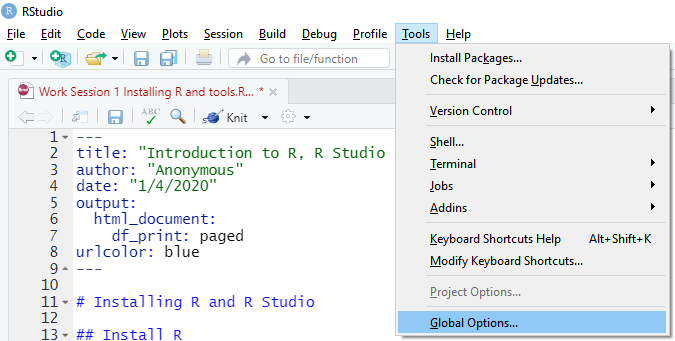
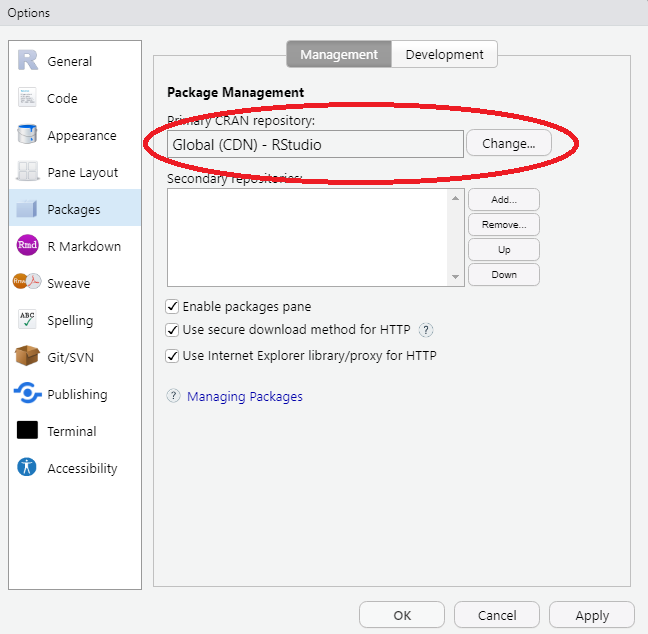
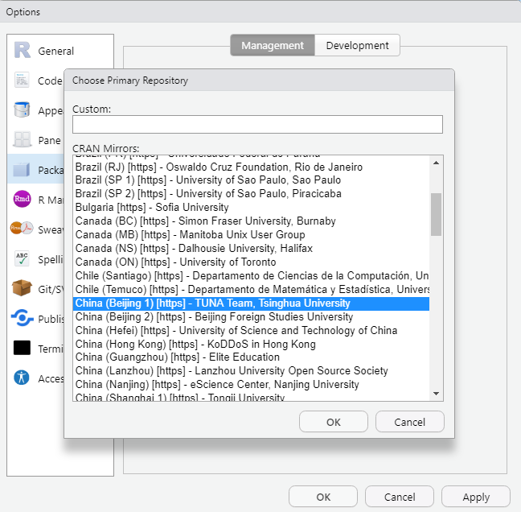
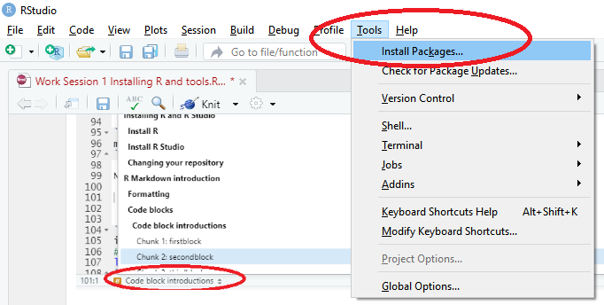
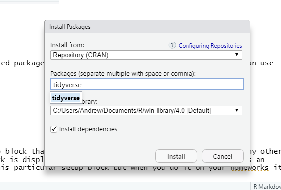
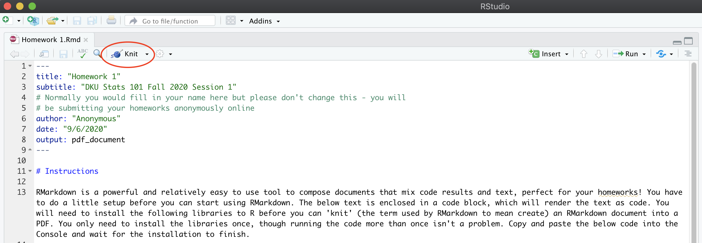
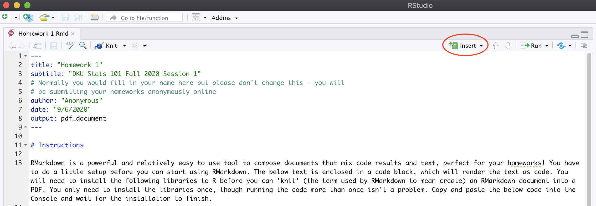
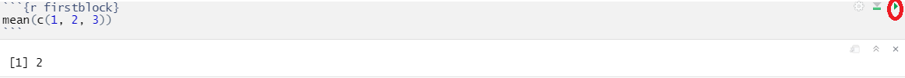
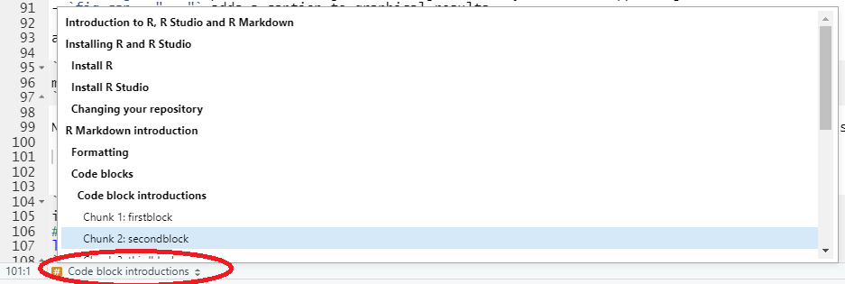

# Installing R and R Studio

## Install R

First, we need to install R, a statistical package that is the foundation for all of the code we will run. You can download R for your computer here: [R installation](https://mirrors.tuna.tsinghua.edu.cn/CRAN/)

## Install R Studio

Next, you need to install the user interface for interacting with the R package, R Studio. You can install it from here: [R Studio installation](https://rstudio.com/products/rstudio/download/#download). The free version works fine for us, no need to select any of the more expensive versions.

## Changing your repository

For those of you in China, it will be very helpful to change the location from which R Studio tries to download additional packages (pieces of software that extend R Studio). The default is a server in the U.S. that can be quite slow.



Make sure to select `Packages` on the left hand column then click the `Change` button on Package Management



It may take a second for the full list to fill in, be patient on this step. Scroll down to the China list and select the Beijing Tsinghua option, then click `OK`



## Installing packages

Sometimes we want to use some external, user-generated tools (called packages) that require special downloading before we can use them. To install a new package is easy.

First, select the Install Packages from the Tools menu.



Then, simply enter the name of the package you want to install and click `Install`



Go ahead and enter `tidyverse` and click Install on the packages. Tidyverse includes a bundle of packages that all will prove very useful for this course. Downloading this package will take quite some time but will download most of the packages we need for this class.

# R Markdown introduction

## Knitting

The Knitting process creates your document. It is a powerful tool that can transform your R Markdown document into an HTML file, a PDF, slides, word document, or a variety of other formats. For this class, however, we will be making HTML files, which is the default option. When you are finished with your homework or project, you can Knit the document to create the HTML file. To do so, click the Knit button at the upper left of your window, as shown in the image. 



- Go ahead and make some small changes in the text and click Knit to see how the document changes.

## Formatting

R Markdown is a powerful and relatively easy to use tool to compose documents that mix code results and text, perfect for your homeworks! 

You can format your text with the following syntax:

- Lists (using the dash characters (-) on the left)
- *italics*
- **bold**
- `code`
- [links](https://rmarkdown.rstudio.com/lesson-1.html)
- etc. 

There are quite a few options for marking up your document, you can find more of them here:

[Examples of commonly used syntax](https://rmarkdown.rstudio.com/authoring_basics.html)  
[Complete guide](https://pandoc.org/MANUAL.html#pandocs-markdown)

The homeworks generally won't need very much markup though you may want to add more for your midterm and final projects.

- Go ahead and change the formatting of a few things in the document and click Knit to see how things change

## Code blocks

Code blocks are the heart of R Markdown. Including them allows you to mix text and code to create complex documents.

### Code block introductions

To insert the results of R code into your document you need an R code block. In the upper right hand part of your window, there is a button where you can insert a code block into R Markdown (though you can also type this by hand). 



In the code block below, the `{r` part tells the Knit procedure that you are executing R code and the `firstblock}` part simply names the code block.

```{r firstblock}
mean(c(1, 2, 5))
```

You can run a code block to test it without knitting the whole document by clicking on the green triangle in the upper right hand corner of the code block.



### Code block options

You have a few options that alter the way code blocks are displayed on your finished document. Note the difference between the output of these code blocks:

```{r secondblock, include=FALSE}
mean(c(1, 2, 3))
```

```{r thirdblock, echo=FALSE}
mean(c(1, 2, 3))
```

A few other options include (taken from the tutorial linked earlier):

- `message = FALSE` prevents messages that are generated by code from appearing in the finished file.
- `warning = FALSE` prevents warnings that are generated by code from appearing in the finished.
- `fig.cap = "..."` adds a caption to graphical results.

and can be combined like so:

```{r fourthblock, echo=FALSE, warning=FALSE}
mean(c(1, 2, 3))
```

Note that you can quickly navigate between different code blocks using the menu at the bottom left shown here:



### Using packages in R Markdown

Generally, the first code block of your document should be a setup block that tells R which libraries you want to use and any other starting code. You should set it so none of the output of the block is displayed in the document. The below code block loads an important library downloaded as part of the `tidyverse` package from the previous step into R for use. I have marked `echo=TRUE` for this particular setup block but when you do it on your homeworks it should be set to `echo=FALSE`.  

```{r setup, include=TRUE, echo=TRUE, warning=FALSE, message=FALSE}
# You should put here any libraries that you will use in your data analysis.
library(dplyr)
```

Additional R code blocks that rely on the `dplyr` library can be added to your document anywhere after the document header. The below code finds the mean of `mpg` for one of R's built-in dataset `mtcars` using the `dpylr` library. Don't worry about the syntax of the code just yet.

```{r test-code, echo=FALSE}
mtcars %>%
  summarize(median(mpg))
```