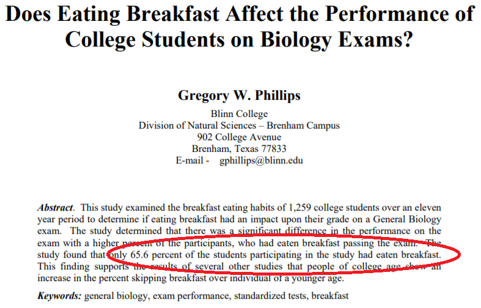

```{r setup, include=FALSE}
knitr::opts_chunk$set(echo = FALSE)
knitr::opts_chunk$set(warning = FALSE)
knitr::opts_chunk$set(message = FALSE)
library(tidyverse)
library(knitr)
library(broom)
library(gridExtra)
library(scales)
library(learnr)

theme_set(theme_classic())

set.seed(1234567)
options(scipen=999)

mean.multiple.samples <- function(numdraws, numsamples, variable) { 
     meanvector <- c() 
     meanonesample <- 0 
     for (i in 1:numsamples) { 
	   meanonesample <- mean(sample(variable, numdraws, replace=TRUE)) 
         meanvector[i] <- meanonesample 
     } 
     meanvector 
}

kc.house <- read.csv("www/kc.house.data.original.csv")
classroster <- read.csv("www/classroster.csv", fileEncoding="UTF-8-BOM")

view.frac <- round(mean(kc.house$view), digits=3)
view.percent <- view.frac*100
view.sd <- round(sqrt(view.frac*(1-view.frac)/100), digits=3)

view.dist <- mean.multiple.samples(100, 1000000, kc.house$view)
view.dist.plot <- ggplot(data.frame(view.dist), aes(view.dist)) +
  geom_histogram(color="darkblue", fill="lightblue") + 
  labs(x="Sample mean of percent of houses that have a view", y="Count")

survey.view.frac <- quantile(view.dist,probs=c(0.85))
survey.view.z <- (survey.view.frac - mean(kc.house$view))/sqrt(view.frac*(1-view.frac)/100)
survey.view.p <- pnorm(survey.view.z)
  
p <- 13
q <- 11
p.frac <- p/(p+q)
q.frac <- q/(p+q)
p.null <- 0.656
q.null <- 1-p.null
se.p <- sqrt(p.null*q.null/(p+q))
z.p <- (p.frac - 0.656)/se.p
p.val.p <- pnorm(z.p)

p.frac <- round(p.frac, digits=3)
q.frac <- round(q.frac, digits=3)
se.p <- round(se.p, digits=3)
z.p <- round(z.p, digits=3)
p.val.p <- round(p.val.p, digits=3)
```

# Hypothesis tests

* Hypotheses
* $p$ values
* The reasoning of hypothesis testing
* A hypothesis test for the mean
* Interval and tests
* $p$ values and decisions: what to tell about a hypothesis test

## Hypotheses

### King county

```{r kingcounty, echo=FALSE, out.width="100%", fig.cap="One sided test"}

```

### Percent of houses with a view

* `r view.percent`% of houses in King County have a view 

* Put ourselves in the shoes of a a researcher – we only have a budget to drive around and sample 100 houses in a particular neighborhood

* Does our sample represent the the idea that the neighborhood we chose to sample has a higher or lower percentage of houses with a view as compared to the overall county?

### Hypotheses

* The starting hypothesis to be tested is call the null hypothesis – null because it assumes that nothing has changed.
  + We denote it $H_0$
  + Called "H naught"
    - $H_0$: parameter = hypothesized value
    - $H_0$: has.a.view = `r view.frac`

* The alternative hypothesis is not a single value, it contains all other values
  + $H_A$: parameter $\neq$ hypothesized value
  + $H_A$: has.a.view $\neq$ `r view.frac`

### How small to convince us? 

* If the percent of houses with a view in our sample is `r (view.frac+0.05)*100`%, we would be skeptical that there was any difference
  + Not so unlikely to be different only by random chance

* If the percent of houses with a view is `r (view.frac+0.2)*100`%, it would clearly indicate a change from `r view.frac*100`%
  + Extremely unlikely that this could happen just by random chance

* Can turn to confidence interval
  + Standard deviation **of the sampling distribution**
  + $SD(p) = \sqrt{\frac{pq}{n}} = \sqrt{\frac{`r view.frac`\times`r 1-view.frac`}{100}} = `r view.sd`$
  
### Is the rate of houses with a view different?

* Idea: simulation

```{r viewsamplingdistplot, fig.height=5, fig.cap="Sampling distribution of view based on n=100"}
view.dist.plot
```

### Is the rate of houses with a view different?

* In 95% of samples of this size, percent of houses with a view is within `r quantile(view.dist,probs=c(0.025))*100`% to `r quantile(view.dist,probs=c(0.975))*100`% just by chance

* In any given sample, should see between `r quantile(view.dist,probs=c(0.025))*100`% and `r quantile(view.dist,probs=c(0.975))*100`% of houses with a view

* If we surveyed a neighborhood and actually saw `r survey.view.frac*100`%

* Surprising?

* Should we conclude that the percent of houses with a view in this neighborhood is different overall compared to King County?

### CLT means we can use the Normal model

* Central Limit Theorem: use Normal model to find probability instead of using a simulation

* View rate of `r survey.view.frac`, `r survey.view.frac-view.frac` from null hypothesis, `r view.frac`

* Use the SD = `r view.sd` to find the area in the tails that lie more than `r round(survey.view.z, digits=3)` $z$ scores away from the null hypothesis

* Indicates how rare observed rate is

* Probability is `r 1-round(survey.view.p, digits=3)` in each tail, or about `r (1-round(survey.view.p, digits=3))*2` total that we would get an observation this far or father from the mean by chance

### Conclusion

* A difference in view percentages of houses of `r survey.view.frac-view.frac` or larger would happen about `r (1-round(survey.view.p, digits=3))*2*100`% of the time just by chance.

* Does/Doesn’t seem very unusual. 
  + **Both?**

* So observed proportion of `r survey.view.frac` does/doesn’t provide evidence that this sample has a different percentage of houses with a view 
  + **Borderline**

### A trial as a hypothesis test

* Begin with the presumption of innocence ($H_0$)

* Collect evidence
  + Bank money in house
  + Still wearing mask
  + Getaway car found in his name

* Evidence beyond a reasonable doubt?
  + Is 5% small enough chance?
  + How about 1%?
  + 6.7%?

### A trial as a hypothesis test - decision

* Beyond a reasonable doubt - ambiguous

* Jury does not use probability to decide.

* Null hypothesis - quantify exactly how surprising the evidence would be if the null hypothesis were true

* How unlikely is unlikely?

* 1 out of 20, 5%, or 0.05

* 1 out of 100, 1%, or 0.01

* You must judge for yourself in each situation whether the probability of observing your data is small enough to constitute "reasonable doubt."

## $p$ values

### The $p$ value and surprise

* The $p$ value is the probability of seeing data like these (or even more unlikely data) given the null hypothesis is true.

* Tells us how surprised we would be to get these data given $H_0$ is true.

  + $p$ value is very low:  Either $H_0$ is not true or something remarkable occurred. Reject $H_0$.

  + $p$ value is high:  Not a surprise. Data consistent with the model. Do not reject $H_0$.

### Guilty or not enough evidence?

* Defendant is either:
  + Guilty: $p$ value too small. The evidence is clear.
  + Not Guilty: $p$ value not small enough. The evidence is not sufficient. Not the same as innocent.  
      + May be innocent or may be guilty, but not enough evidence found.
  
* Two Choices
  + Fail to reject $H_0$ if $p$ value large. 
    - *Never* accept $H_0$.
  + Reject $H_0$ if $p$ value is small. Accept $H_A$.

### When the $p$ value is not small

* It is wrong to say:
  + Accept $H_0$.
  + We have proven $H_0$.
  
* It is correct to say:
  + Fail to reject $H_0$
  + There is insufficient evidence to reject $H_0$.
  + $H_0$ may or may not be true.

* Example:  $H_0$:  All swans are white.
  + If we sample 100 swans that are all white, there could still be a nonwhite swan.

## The reasoning of a hypothesis test

### Step 1: state the hypothesis

* $H_0$:
  + $H_0$ usually states that there’s nothing different.
  + $H_0:$  parameter = hypothesized value
  + Note the parameter describes the population not the sample.
  + $H_0$ is called the **null hypothesis**.
  
* $H_A$:
  + $H_A$ is a statement that something has changed, gotten bigger or smaller
  + $H_A$ is called the alternative hypothesis.

### Hypotheses about breakfast

```{r breakfaststudy, echo=FALSE, out.width="100%", fig.cap="One sided test"}

```

What would our hypotheses be if we did a study of DKU students and compared it to the percentage found in this paper (treat it as the population mean)?

```{r picker1, exercise=TRUE}
sample(classroster$name, 1)
```

### Hypotheses about breakfast

* Our data claims that 65.6% of students don’t eat breakfast.  

* In a survey of `r p+q` students at DKU, `r p` ate breakfast.

* Is there evidence that breakfast rate is below 65.6%?
  + $H_0: p = 0.656$
  + $H_A: p \neq 0.656$

### Step 2: the model

* Decide on the model to test the null hypothesis and parameter.

* Check conditions, e.g. independence, sample size.

* If the conditions are not met, either quit or redesign the study.

* Normal models use $z$ scores.  Other models may not use $z$ scores.

* Name the model, e.g. 1-proportion $z$ test.

### Step 2a: 1-proportion $z$ test

* Conditions: same as a 1-Proportion $z$ interval

* Null hypothesis: $H_0: p = p_0$

* Test statistics
  + $z = \frac{\hat{p}-p_0}{SD(\hat{p})}$
  + $SE(\hat{p}) = \sqrt{\frac{p_0q_0}{n}}$

What conditions do we need to check to do a 1-proportion $z$ test?

```{r picker2, exercise=TRUE}
sample(classroster$name, 1)
```

### Step 2b: checking conditions - eating breakfast

* Randomization Condition:  The `r p+q` students were a random selection of DKU students

* 10% Condition: `r p+q` is fewer than 10% of the total number of all students who are of interest.

* Success/Failure Condition:  

* $np_0 = (`r p+q`)(`r p.frac`) = `r p` > 10$?

* $np_0 = (`r p+q`)(`r q.frac`) = `r q` > 10$? 

* The conditions are satisfied.  We can use the Normal model and perform a 1-Proportion z-Test.

### Step 3: mechanics

* Claim:  65.6% students eat breakfast.
  + `r p` students in our class ate breakfast.

* Find $p$ value
  + $SE(\hat{p})=\sqrt{\frac{`r p.null`\cdot`r q.null`}{`r p+q`}}$
  + $z$ score of difference = $\frac{`r p.frac` - 0.656}{`r se.p`} = `r z.p`$

* Probability of seeing that large a difference: $pnorm(`r z.p`)\rightarrow$ `r (p.val.p)*100*2`% of the time we will see a difference from the mean this large or larger
  + `r 100-(p.val.p*100*2)`% of the time we will see a difference this small or smaller.
  + Note: $p$ values usually reported as “this large or larger”

What can we conclude from these results?

```{r picker3, exercise=TRUE}
sample(classroster$name, 1)
```

### Step 4: conclusion

* Is our sample different than the overall mean of students in the US?  $p$ value = `r (p.val.p*2)`

* What can be concluded?  What does the $p$ value mean?

  + $p$ value = `r (p.val.p*2)` $\rightarrow$ Fail to Reject/Reject $H_0$

  + The survey data does not provide strong evidence that the rate that DKU students eat breakfast is different than US average.

  + This should not be the end of the conversation.

  + The next step would be to see if the breakfast eating rate is lower for all classes/among freshman/sophomores/etc.

## A hypothesis test for the mean

### One sample $t$ test for the mean

* Assumptions are the same.

* $H_0: \mu=\mu_0$

* $t_{n-1}=\frac{\bar{y}-\mu_0}{SE(\bar{y})}$ 

* Standard Error of $\bar{y}: SE(\bar{y})=\frac{\sigma}{\sqrt{n}}$

* When the conditions are met and $H_0$ is true, the statistic follows the Student’s $t$ Model with $n – 1$ df.

* Use this model to find the $p$ value.

## Interval and tests

### Intervals and tests

* Confidence Intervals
  + Start with data and find plausible values for the parameter. CI is data-centric.
  + Always 2-sided

* Hypothesis Tests
  + Using CI, is proposed parameter value consistent with interval? Test is model-centric.
  + 2-sided test:  Within the confidence interval means fail to reject $H_0$.  
  + $p$ value = 1 – C is the cutoff.

### The special case with proportions

* Confidence intervals
  + Use $\hat{p}$ to calculate $SE(\hat{p})=\sqrt{\frac{\hat{p}\hat{q}}{n}}$

* Hypothesis Tests
  + Use $\hat{p}$ to calculate $SD(\hat{p})=\sqrt{\frac{pq}{n}}$                    

If $SE(\hat{p})$ and $SD(\hat{p})$ are far from each other, the relationship between the confidence interval and the hypothesis test breaks down.

## $p$ values and decisions: what to tell about a hypothesis test

### How small a $p$ value is small enough?

* How small is small enough is context specific.

* Test to see if a renowned musicologist can distinguish between Mozart and Hayden.
  + $p$ value of 0.1 may be good enough.  Just reaffirming known talent.

* A friend claims psychic abilities and can predict heads or tails.
  + Very small $p$ value such as 0.01 needed.  Breaking scientific theory.

### Acceptable $p$ value depends on result's importance

* Proportion of students with full time jobs has increased.
  + Not that important.  $p$ value = 0.05 will work.

* Testing the strength of a bridge based on a sample of concrete quality
  + Life and death decision.  Need a very small $p$ value

* Whether rejecting or failing to reject, always cite the $p$ value.

* An accompanying confidence interval helps also.

### Recommendations from the American Statistical Association

1. $p$ values can indicate how incompatible the data are with a specified statistical model. 
2. $p$ values do not measure the probability that the studied hypothesis is true, or the probability that the data were produced by random chance alone. 
3. Scientific conclusions and business or policy decisions should not be based only on whether a $p$ value passes a specific threshold. 
4. Proper inference requires full reporting and transparency. 
5. A $p$ value, or statistical significance, does not measure the size of an effect or the importance of a result. 
6. By itself, a $p$ value does not provide a good measure of evidence regarding a model or hypothesis.

