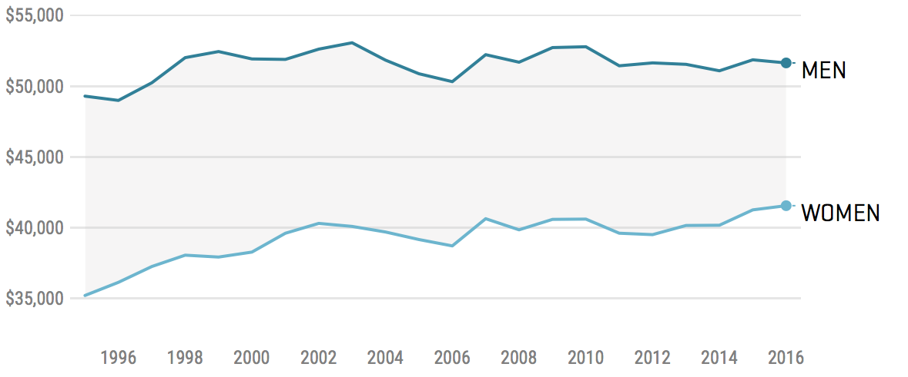

```{r setup, include=FALSE}
knitr::opts_chunk$set(echo = FALSE)
knitr::opts_chunk$set(warning = FALSE)
knitr::opts_chunk$set(message = FALSE)
library(tidyverse)
library(knitr)
library(kableExtra)
library(broom)
library(gridExtra)
library(scales)
library(infer)
library(learnr)

theme_set(theme_classic())

set.seed(8675309)
options(scipen=999)

auto.mpg <- read.csv("www/auto.mpg.csv")
wages <- read.csv("www/us.dol.wages.csv")
classroster <- read.csv("www/classroster.csv", fileEncoding="UTF-8-BOM")

auto.mpg <- auto.mpg %>% 
    mutate(weight.tons = weight/2000)

lmodel <- lm(mpg~weight.tons, data=auto.mpg)

wages <- wages %>% 
  mutate(sex = factor(sex, levels=c("male", "female"), labels=c("Male", "Female")))

wage.model <- lm(lwage ~ exp + bluecol + ed + sex, data=wages)
wage.model.augmented <- augment(wage.model, wages)
wage.model.tidy <- tidy(wage.model)
```

# Returning to regression

* Moving from description to inference
* Review of regression conditions
* Sampling distribution of models
* Inference for regression

## Moving from description to inference

### Returning to regression

```{r simplemodel, exercise=TRUE}
lmodel <- lm(mpg~weight.tons, data=auto.mpg)

summary(lmodel)
```

How would you interpret all parts of this model except the $p$ value, $t value$ and $Std. Error$?

```{r picker1, exercise=TRUE}
sample(classroster$name, 1)
```

### Model

* The equation of the least squares line $\hat{mpg} = 46.32−15.35\times weight$
* Slope of -15.35 indicates that the miles per gallon of cars is on average 15.35 less for each additional ton the car weighs.
* How useful is the model?
* Slope and intercept are descriptions of data - want to know how certain we are of this slope estimate
* Want to understand what it can tell us beyond the 400 cars in the study
* Construct CI, test hypotheses about slope, intercept

### Sample vs. model regression

* Sample:  
  + $\hat{y}=b_0 + b_1x$
  + This gives a prediction for $y$ based on the sample.
* Model:   
  + $\mu_y = \beta_0 + \beta_1x$
  + $b_0$ = y-intercept for the model
  + $b_1$ = slope for the model
  + The model assumes that for every value of $x$, the mean of the $y$'s lies on the line.

```{r out.width="100%", fig.cap="Slope variability"}
knitr::include_graphics("www/slope.variability.png")
```

Just as with a mean, if we sample many times from a population, we will, by chance, get variation in our estimate of the slope of the relationship between the two variables. 

```{r manysamples, exercise=TRUE}
many_samples <- auto.mpg %>% rep_sample_n(size = 50, reps = 50)

ggplot(many_samples) + 
  # Add a point layer
  geom_point(data=auto.mpg, aes(x=weight.tons, y=mpg)) + 
  # Add a smooth trend layer, using lin. reg., no ribbon
  geom_smooth(aes(x=weight.tons, y=mpg, group=replicate), method="lm", se=FALSE) +
  geom_smooth(data=auto.mpg, aes(x=weight.tons, y=mpg), method="lm", se=FALSE, color="red") +
  labs(x="Weight in tons", y="Miles per gallon")
```

We can then make a histogram of each of these slope estimates.

```{r manyhistograms, exercise=TRUE}
many_samples <- auto.mpg %>% rep_sample_n(size = 50, reps = 50)

many_lms <- many_samples %>% 
  group_by(replicate) %>% 
  do(lm(mpg ~ weight.tons, data=.) %>% tidy()) %>%
  filter(term == "weight.tons")

# Using many_lms, plot estimate
ggplot(many_lms, aes(x=estimate)) +
  # Add a histogram layer
  geom_histogram(fill="blue4") +
  labs(x="Slope estimate", y="Count")
```

In expectation, what shape should we expect the distribution of slope estimates to conform to? Why?

```{r picker2, exercise=TRUE}
sample(classroster$name, 1)
```

### Errors

* The model predicts the mean of $y$ for each $x$, but misses the actual individual values of $y$
  + $\mu_y = \beta_0 + \beta_1x$

* The error, e, is the amount the line misses the value of $y$.
  + $\hat{y} = \beta_0 + \beta_1x+e$

* This new equation gives the exact value of each of the $y$’s.

## Review of regression conditions

### Straight enough condition

* Straight enough condition
  + Does the scatterplot look relatively straight?
    - Don’t draw the line. It can fool you.
  + Look at scatterplot of the residuals.
    - Should have horizontal direction
    - Should not have a pattern
  + If straight enough, check the other assumptions.
  + If not straight, stop or re-express.

```{r conditionscheck1, exercise=TRUE}
ggplot(auto.mpg, aes(x=weight.tons, y=mpg)) +
  geom_point() + 
  geom_smooth(method="lm", se=FALSE) +
  labs(x="Weight in tons", y="Miles per gallon")
```

### Independence assumption

* Errors ($e$’s) must be independent of each other.
  + Check residuals plot.
    - Should not have clumps, trends, or a pattern.
    - Should look very random.
  + To make inferences about the population, the sample must be representative.
  + For $x = time$, plot residuals vs. residuals one step later.
    + Should look very random

We can partially check the independence assumption by viewing the residuals. 

```{r conditionscheck2, exercise=TRUE}
lmodel.augmented <- augment(lmodel, auto.mpg)

ggplot(lmodel.augmented, aes(.fitted, .resid)) + 
  geom_point() + 
  geom_hline(yintercept = 0, color = "blue", linetype='dashed') + 
  labs(y = "Residuals", x="Predicted")
```

### Equal variance assumption

* Variability of $y$ same for all $y$
  + Does the plot thicken? condition:  Spread along the line should be nearly constant.
    - “Fan shape” is bad.
  + Standard deviation of residuals, $s_e$, will be used for CI and hypothesis tests.  
    - This requires same variance for each $x$.

The equal variance assumption can be analyzed by also viewing the residual plot.

```{r conditionscheck3, exercise=TRUE}
lmodel.augmented <- augment(lmodel, auto.mpg)

ggplot(lmodel.augmented, aes(.fitted, .resid)) + 
  geom_point() + 
  geom_hline(yintercept = 0, color = "blue", linetype='dashed') + 
  labs(y = "Residuals", x="Predicted")
```

### Normal population assumption

* As with the $t$ and $z$ test, we are relying on the Central Limit Theorem that our sampling distribution of our statistic being normally distributed
  + Statistic in this case is not mean but regression coefficient
* To meet this condition, the errors for each fixed $x$ must follow the Normal model.
  + Good enough to use the Nearly Normal Condition and the Outlier condition for the predictors. 
  + Look at the histograms. 
  + With large sample sizes, the Nearly Normal Condition is usually satisfied.

The normal population assumption can be partially checked by viewing a histogram of the residuals.

```{r conditionscheck4, exercise=TRUE}
lmodel.augmented <- augment(lmodel, auto.mpg)

ggplot(lmodel.augmented, aes(.resid)) + 
  geom_histogram(fill="blue4", color="black") +
  labs(y = "Count", x="Residual")
```

Do these plots indicate that the conditions for regression are satisfied?

```{r picker3, exercise=TRUE}
sample(classroster$name, 1)
```

### Which comes first, the conditions or the residuals?

1. Check Straight Enough Condition with scatterplot.
2. Fit regression, find predicted values and residuals.
3. Make scatterplot of residuals and check for thickening, bends, and outliers.
4. For data measured over time, use residuals plot to check for independence.
5. Check the Nearly Normal Condition with a histogram and Normal plot of residuals.
6. If no violations, proceed with inference.

* Note: Stop if at any point there is a violation.

## Sampling distribution of models

### Sample to sample variation of the slope and intercept

* Null hypothesis (usually) - regression slope = 0
  + $H_0: b_1 = 0$
  + $H_a: b1 \neq 0$

* $p$ values in the table come from tests of this hypothesis for each coefficient.
* To calculate $p$ value, we need to describe our sampling distribution. 
* The mean of the sampling distribution of the regression slope will be 0, from the null hypothesis.
* We assume shape of the sampling distribution will be normal (from the Central Limit Theorem)
* Standard errors (or our estimate of the standard deviation of the sampling distribution) must come from the data.
* Each sample of 400 cars will produce its own line with slightly different $b_0$’s and $b_1$’s.

### Spread around the line

* Less scatter along the line $\rightarrow$ slope more consistent
* Residual standard deviation, $s_e$, measures this scatter.

```{r out.width="100%", fig.cap="Spread around the line"}
knitr::include_graphics("www/regression.scatter.png")
```

* Less scatter around the line, smaller the residual standard deviation and stronger the relationship between $x$ and $y$
* Some assess strength of regression by looking at $s_e$
* It has the same units as $y$
* Tells how close data are to the our model.
* $r^2$ is proportion of the variation of $y$ accounted for by $x$

```{r modelresults, exercise=TRUE}
summary(lmodel)
```

* Larger $s_x$ (SD in $x$) $\rightarrow$ more stable regression

```{r out.width="100%", fig.cap="Spread in x's"}
knitr::include_graphics("www/regression.stability.png")
```

### Sample size

* Larger sample size $\rightarrow$ more stable regression

```{r out.width="100%", fig.cap="Sample size stability"}
knitr::include_graphics("www/regression.sample.size.png")
```

### Standard error for the slope

* Three aspects of the scatterplot, then, affect the standard error of the regression slope: 
  + Spread around the model: $s_e$
  + Variation among the $x$ values.
  + Sample size: $n$ 
* These are in fact the **only** things that affect the standard error of the slope.

### Standard error formally

* The standard error for the slope parameter is estimated by:
  + $SE(b_1) = \frac{s_e}{\sqrt{n-1}s_x}$ where $s_e = \sqrt{\frac{\sum{(y-\hat{y})^2}}{n-2}}$

* We can then calculate how many $t$ units our slope estimate is from the null hypothesis by:
  + $t=\frac{b_1-\beta_1}{SE(b_1)}$
  + The $t$ follows Student's $t$ model with $df=n-2$

* Don't need to remember the SE formula, just note that the process is exactly the same as for the mean
  + Find the number of $t$ units the slope is away from the mean
  + Use that $t$ score to find a $p$ value of how likely it would be to observe a difference in slopes that larger or larger from the null just by chance

## Inference for regression
  
### Example - wages

* It has long been known women earn less than men, and this fact is often taken as evidence of discrimination
* How to test with statistics though?

```{r out.width="100%", fig.cap="Gender wage gap"}

```

### What about a $t$ test?

* Slam dunk case right??

```{r wagettest, exercise=TRUE}
t.test(wages$wage[wages$sex=="Male"], wages$wage[wages$sex=="Female"])
```

What are some reasons why this $t$ test might be misleading?

```{r picker4, exercise=TRUE}
sample(classroster$name, 1)
```

### Other factors

* Women dropping out of the labor force
* Impact of high earning men influencing the calculation (outliers)
* Women's career choice
* Differences in educational attainment
* Other factors?

### 1. Check straight enough condition

Two-way scatterplots

```{r wageconditioncheck1, exercise=TRUE}
plot1 <- ggplot(wages, aes(x=exp, y=wage, color=sex)) +
  geom_point(position="jitter") +
  labs(x="Experience", y="Wage")

plot2 <- ggplot(wages, aes(x=ed, y=wage, color=sex)) +
  geom_jitter() +
  labs(x="Education", y="Wage")

grid.arrange(plot1, plot2)
```

Histogram of wage

```{r wageconditioncheck2, exercise=TRUE}
ggplot(wages, aes(x=wage)) +
  geom_histogram(fill="blue4", color="black") +
  labs(x="Wage", y="Count")
```

Histogram of log(wage)

```{r wageconditioncheck3, exercise=TRUE}
ggplot(wages, aes(x=lwage)) +
  geom_histogram(fill="blue4", color="black") +
  labs(x="Log wage", y="Count")
```

Do these plots suggest the straight enough condition has been met?

```{r picker5, exercise=TRUE}
sample(classroster$name, 1)
```

### 2. Fit the regression

```{r wageconditioncheck4, exercise=TRUE}
wage.model <- lm(lwage ~ exp + bluecol + ed + sex, data=wages)

summary(wage.model)
```

Interpret this regression table.

```{r picker6, exercise=TRUE}
sample(classroster$name, 1)
```

### 3. Check the residuals

```{r wageconditioncheck5, exercise=TRUE}
wage.model.augmented <- augment(wage.model, wages)
wage.model.tidy <- tidy(wage.model)

ggplot(wage.model.augmented, aes(.fitted, .resid)) + 
  geom_point() + 
  geom_hline(yintercept = 0, color = "blue", linetype='dashed') + 
  labs(y = "Residuals", x="Predicted")
```

### 4. Check the Nearly Normal condition of the residuals

```{r wageconditioncheck6, exercise=TRUE}
ggplot(wage.model.augmented, aes(.resid)) + 
  geom_histogram(fill="blue4") + 
  labs(x="Residuals of lwage regression")
```

Do the residual plots suggest the conditions of the residuals have been met?

```{r picker7, exercise=TRUE}
sample(classroster$name, 1)
```

### 5. Proceed with inference

```{r wageconditionscheck7, exercise=TRUE}
females <- wages %>% 
  filter(as.character(sex)=="Female")

males <- wages %>% 
  filter(as.character(sex)=="Male")

wage.model$coefficients

t.test(males$lwage, females$lwage)
```

How should we understand the coefficient of $sex$ from the regression compared to the simple difference of means between male and female?

```{r picker8, exercise=TRUE}
sample(classroster$name, 1)
```

### Collinearity

* Variables are said to be collinear when their correlation is very high
  + Ex: HDI score and GDP/capita
* What the regression model is trying to do is apportion the amount of responsibility of each predictor independent of the other predictors
  + i.e. What is the impact of female INDEPENDENT of all other predictors?

### Collinearity

* When predictor is collinear
  + Coefficient surprising: unanticipated sign or unexpectedly large or small value
  + SE of coefficient can be inflated, leading to smaller $t$ statistic, larger $p$ value

* What to do?
  + Remove some of the predictors
    + Simplifies model, improves $t$ statistic of slope (usually)
  + Keep those most reliably measured, least expensive to find, or ones that are politically important


