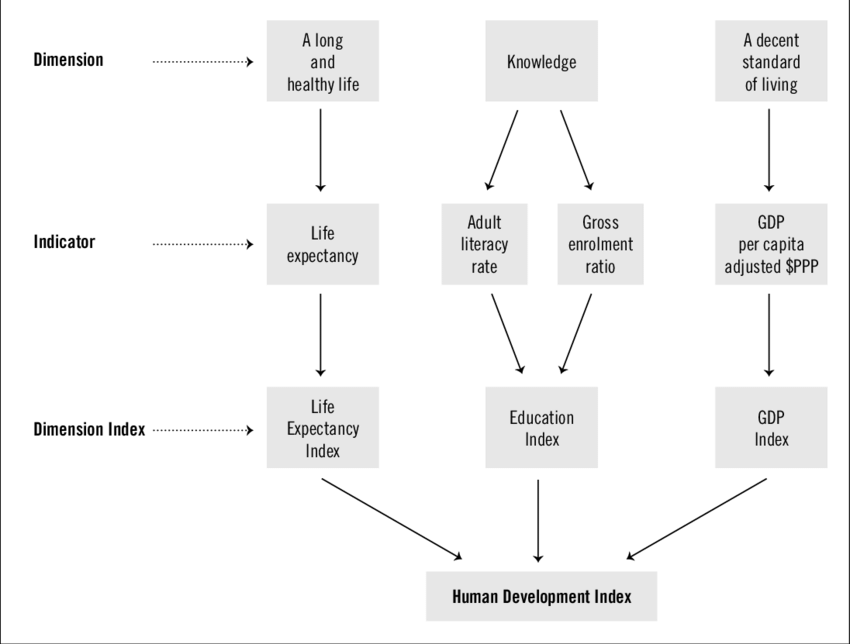
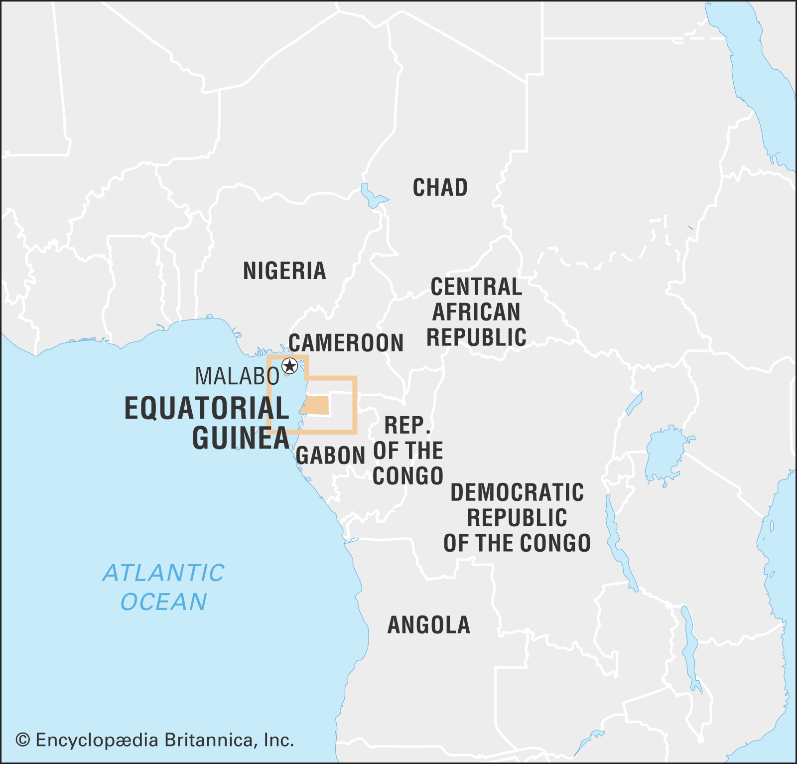

```{r setup, include=FALSE}
knitr::opts_chunk$set(echo = FALSE)
knitr::opts_chunk$set(warning = FALSE)
knitr::opts_chunk$set(message = FALSE)
library(tidyverse)
library(knitr)
library(broom)
library(gridExtra)
library(learnr)

theme_set(theme_classic())

classroster <- read.csv("www/classroster.csv", fileEncoding="UTF-8-BOM")

global.data <- read.csv("www/HDI.2015.csv")

global.data.nooutlier <- global.data %>%
  filter(gdp.capita < 100000)

global.data.log <- global.data %>%
  mutate(log.gdp.capita = log(gdp.capita))

hdi.model <- lm(hdi.score ~ gdp.capita, data=global.data)
global.data.augmented <- augment(hdi.model, global.data)
hdi.model.tidy <- tidy(hdi.model)

hdi.model.nooutlier <- lm(hdi.score ~ gdp.capita, data=global.data.nooutlier)  
global.data.augmented.nooutlier <- augment(hdi.model.nooutlier, global.data.nooutlier)
hdi.model.tidy.nooutlier <- tidy(hdi.model.nooutlier)

hdi.model.log <- lm(hdi.score ~ log.gdp.capita, data=global.data.log)
global.data.augmented.log <- augment(hdi.model.log, global.data.log)
hdi.model.tidy.log <- tidy(hdi.model.log)
```

# Linear model

## Line of best fit

```{r hdi, fig.cap="HDI definition^[https://www.researchgate.net/figure/Structure-of-the-Human-Development-Index_fig1_23725014]", out.width = "600px"}

```

How to describe the relationship between `GDP per capita` and `HDI score`?

As we learned:

- Direction
- Form
- Strength
- Outlier

What do you expect the relationship between GDP per capita and HDI will be?

```{r picker0, exercise=TRUE}
sample(classroster$name, 1)
```

## Scatterplot of `GDP per capita` and `HDI`

```{r scatterplot, exercise=TRUE}
ggplot(global.data, aes(x=gdp.capita, y=hdi.score)) +
  geom_point() +
  labs(x="GDP per capita", y="Human Development Index (HDI) score")
```

### Smoother

```{r smoother, exercise=TRUE}
ggplot(global.data, aes(x=gdp.capita, y=hdi.score)) +
  geom_point() +
  labs(x="GDP per capita", y="Human Development Index (HDI) score") +
  geom_smooth(se=FALSE)
```

### Taking a guess

What do you think the intercept and the slope should be for a line of 'good' fit?

```{r picker1, exercise=TRUE}
sample(classroster$name, 1)
```

```{r guessingslope, exercise=TRUE}
ggplot(global.data, aes(x=gdp.capita, y=hdi.score)) +
  geom_point() +
  labs(x="GDP per capita", y="Human Development Index (HDI) score") +
  geom_abline(intercept = 0, slope=0, color="blue")
```

### Least squares line

>Slope: `r format(hdi.model.tidy$estimate[2], scientific=FALSE)`, intercept: `r format(hdi.model.tidy$estimate[1], scientific=FALSE)` 

```{r leastsquares, exercise=TRUE}
ggplot(global.data, aes(x=gdp.capita, y=hdi.score)) +
  geom_point() +
  labs(x="GDP per capita", y="Human Development Index (HDI) score") +
  geom_smooth(method="lm", se=FALSE)

```

## Linear model

It's better if we come up with a more formal model: $\hat{y}= b_0 + b_1x$

$\hat{y}$ is our predicted value
$b_0$ is the $y$ intercept - the value when $x$ is 0
$b_1$ is the slope

- Helps with predictions
  + For values not in the sample, we can estimate their `HDI score`
- Helps assess model fit - we can compare different lines more easily
  + More specifically we can calculate the **residuals**
  + Residuals are difference between our line and the actually observed value - how much our line 'missed' by

### Linear model for our data

$\hat{y}= `r format(hdi.model.tidy$estimate[1], scientific=FALSE)` + `r format(hdi.model.tidy$estimate[2], scientific=FALSE)`x$

```{r leastsquares2, exercise=TRUE}
ggplot(global.data, aes(x=gdp.capita, y=hdi.score)) +
  geom_point() +
  labs(x="GDP per capita", y="Human Development Index (HDI) score") +
  geom_smooth(method="lm", se=FALSE)
```

## Least squares line

- But how to calculate? 
- Many different ways
  + Make a line minimizing the least absolute deviations
  + Non-parametric lines
  + Make a line minimizing the sum of the squares of the deviations
- Least squares line is most common
  + Advantages: 
    + Easy to calculate
    + Well understood statistical properties
  + Disadvantages: 
    + Line will be strongly influenced by outliers

## Examining model fit

- Checking the residuals
- Residual standard deviation
- $R^2$
- Checking assumptions

### Checking the residuals

All real datasets have noise so the real formula is:

$y = b_0 + b_1x + e$

Residual = Observed - Predicted
  
  + $e = y - \hat{y}$

Can easily plot the residuals, put the  "size of the miss" on the $y$ axis, and original data on the $x$ axis

### Residuals - our data

```{r dataresiduals, exercise=TRUE}
ggplot(global.data.augmented, aes(gdp.capita, hdi.score)) + 
  geom_point() + 
  geom_smooth(method="lm", se=FALSE) +
  geom_segment(aes(xend = gdp.capita, yend = .fitted), linetype="dashed") + 
  labs(x="GDP per capita", y="Human Development Index (HDI) score") 
```

How would you interpret these residuals?

```{r picker2, exercise=TRUE}
sample(classroster$name, 1)
```

## Graphing the residuals

```{r residualsplot, exercise=TRUE}
ggplot(global.data.augmented, aes(gdp.capita, .resid)) + 
  geom_point() + 
  geom_hline(yintercept = 0, color = "blue", linetype='dashed') + 
  labs(y = "Residuals", x="GDP per capita")
```

### Residuals vs. original data

```{r residualsvactual, exercise=TRUE}
original <-
  ggplot(global.data, aes(x=gdp.capita, y=hdi.score)) +
  geom_point() +
  labs(x="GDP per capita", y="Human Development Index (HDI) score") +
  geom_smooth(method="lm", se=FALSE)

resids <- ggplot(global.data.augmented, aes(gdp.capita, .resid)) + 
  geom_point() + 
  geom_hline(yintercept = 0, color = "blue", linetype='dashed') + 
  labs(y = "Residuals", x="GDP per capita")

grid.arrange(original, resids)
```

## Residual standard deviation

- Since the residuals are just another distribution, we can also examine their distribution
  + What to look for: symmetrical, no skew/outliers 
  + Standard deviation not too large

### Residual standard deviation - our data

```{r residualstddev, exercise=TRUE}
ggplot(global.data.augmented, aes(x=.resid)) +
  geom_histogram(fill="blue4") +
  labs(x="Residuals", y="Count")
```

How would you interpret this histogram of the residuals?

```{r picker3, exercise=TRUE}
sample(classroster$name, 1)
```

## $R^2$

$R^2$ is just the return of $r$, the correlation coefficient. Remember:

- $r$ measures the strength of the association between $x$ and $y$
  + That is, how reliably $x$ varies with $y$

- The correlation coefficient: `r round(cor(global.data$hdi.score, global.data$gdp.capita), digits=2)`
- Our $R^2$: `r as.numeric(round(glance(hdi.model)[1], digits=2))`

```{r rsquared, exercise=TRUE}
global.data.nooutlier <- global.data %>%
  filter(gdp.capita < 100000)

hdi.model.nooutlier <- lm(hdi.score ~ gdp.capita, data=global.data.nooutlier)  
global.data.augmented.nooutlier <- augment(hdi.model.nooutlier, global.data.nooutlier)
hdi.model.tidy.nooutlier <- tidy(hdi.model.nooutlier)
```

What do you think the $R^2$ will change to when we remove the outlier?

```{r picker4, exercise=TRUE}
sample(classroster$name, 1)
```

- The correlation coefficient for a model with the outlier removed: 

```{r corroutlier, exercise=TRUE}
round(cor(global.data.nooutlier$hdi.score, global.data.nooutlier$gdp.capita), digits=2)
```

- Our $R^2$ with the outlier removed: 

```{r rsquaredoutlier, exercise=TRUE}
as.numeric(round(glance(hdi.model.nooutlier)[1], digits=2))
```

## How to interpret $R^2$

- If there are no serious outliers and the relationship is linear, can provide a useful measure of how strongly the predictor variable is related to the response variable
  + The two assumptions above are quite strong - you need to always draw a picture to make sure they are true!
  + Should not be interpreted as how strongly $x$ *causes* $y$, we only know about association.

## Regression assumptions

- Quantitative variable assumption
- Straight enough condition
- Outlier condition
- Does the plot thicken condition?

Have we met these? 

```{r picker5, exercise=TRUE}
sample(classroster$name, 1)
```

## Reexpressions

### Log reexpressed

```{r logreexpress, exercise=TRUE}
global.data.log <- global.data %>%
  mutate(log.gdp.capita = log(gdp.capita))

hdi.model.log <- lm(hdi.score ~ log.gdp.capita, data=global.data.log)
global.data.augmented.log <- augment(hdi.model.log, global.data.log)
hdi.model.tidy.log <- tidy(hdi.model.log)
```

What will happen to the shape of the graph?

```{r picker6, exercise=TRUE}
sample(classroster$name, 1)
```

```{r logreexpressplot, exercise=TRUE}
ggplot(global.data.log, aes(x=log.gdp.capita, y=hdi.score)) +
  geom_point() +
  labs(x="Log of GDP per capita", y="Human Development Index (HDI) score") +
  geom_smooth(method="lm", se=FALSE)
```

### Log reexpressed - outlier

Any guess as to the outlier?

```{r picker7, exercise=TRUE}
sample(classroster$name, 1)
```

```{r logoutlier, exercise=TRUE}
ggplot(global.data.log, aes(x=log.gdp.capita, y=hdi.score)) +
  geom_point() +
  labs(x="Log of GDP per capita", y="Human Development Index (HDI) score") +
  geom_smooth(method="lm", se=FALSE) +
  geom_point(data=global.data.log %>% filter(log.gdp.capita > 9.5 & hdi.score < 0.61), color="red") +
  geom_text(data=global.data.log %>% filter(log.gdp.capita > 9.5 & hdi.score < 0.61), aes(label=Country), nudge_y = -0.03)
```

### Outlier

```{r eqguinea1, fig.cap="Equatorial Guinea map", out.width = "400px"}

```

```{r eqguinea2, fig.cap="Teodorin Nguema Obiang, the son of Equatorial Guinea's president Teodoro Obiang^[https://www.voanews.com/a/africa_supercars-houses-and-suits-equatorial-guineas-teodorin-obiang/6184016.html]", out.width = "400px"}

```

```{r eqguinea3, fig.cap="Teodorin's car collection", out.width = "400px"}

```

### Graphing the residuals - log

```{r residualslog, exercise=TRUE}
ggplot(global.data.augmented.log, aes(log.gdp.capita, .resid)) + 
  geom_point() + 
  geom_hline(yintercept = 0, color = "blue", linetype='dashed') + 
  labs(y = "Residuals", x="Log of GDP per capita")
```

### Residuals standard deviation - log

```{r residualstddevlog, exercise=TRUE}
ggplot(global.data.augmented.log, aes(x=.resid)) +
  geom_histogram(fill="blue4") +
  labs(x="Residuals", y="Count")
```

### $R^2$

- The correlation coefficient: `r round(cor(global.data.log$hdi.score, global.data.log$log.gdp.capita), digits=2)`
- Our $R^2$: `r as.numeric(round(glance(hdi.model.log)[1], digits=2))`

### Regression assumptions

For the log reexpressed version, have the assumptions been met?

- Quantitative variable assumption 
- Straight enough condition
- Outlier condition
- Does the plot thicken condition?

```{r picker8, exercise=TRUE}
sample(classroster$name, 1)
```