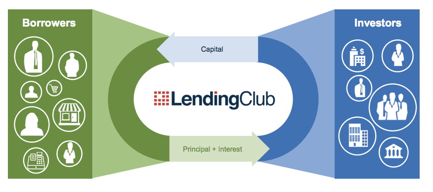

```{r setup, include=FALSE}
# Put any setup code here
```



*LendingClub Business Model*^[Credit to HBS Digital Initiative at https://digital.hbs.edu/platform-digit/submission/lending-club-pioneering-p2p-lending/]

# Assignment Background

Imagine that you are an analyst at a fintech startup that is tasked with considering what kind of customers are typically interested in peer-to-peer loans and under what conditions they are most likely to pay back the loan. Your boss gives you a dataset from a competing platform, LendingClub, and asks you to analyze it to better understand what kind of products you should offer and which kinds of customers your startup should target.^[Credit to Ahmed Dawoud for making this data publicly available at https://www.kaggle.com/ahmedmohameddawoud/lending-club-loan-data-most-accurate]    

# Assignment Instructions

- Please leave the name as Anonymous; the homeworks are blind graded so please do not include your name.
- Save this document as a new document (Save As...) and rename it `Homework 1 Answers.Rmd`. 
- You can import the dataset by entering the code `loans <- read.csv("<file.location>/loans.csv")` into the `setup` code block. For example, the code may look something like this: `loans <- read.csv("E:/Homeworks/Spr Homework 1/loans.csv")` 
- If I say "Interpret..." that means I want at least 1-2 good quality sentences that show that you really understand the output of what R has produced. Short, incomplete sentences that fail to demonstrate you understand your output will have points deducted.
- While the homework isn't a formal document, it should be written as if you are a business analyst presenting this information to a boss - i.e. everything should look neat and tidy, have good labels, and be well organized
- If you have any graphs that you thought were particularly good, post them to the `#graph-contest` Slack channel. I will select a few finalists and the class will vote on the best graph. Winner receives significant extra credit.
- Delete the Assignment Background and Assignment Instructions sections before submitting.

## Part 1: One variable analysis

### Q1: What kind of dataset do we have? (5 points)

- According to the definitions in the textbook, describe the Five W's for this dataset. 

- Using the definitions in the textbook, describe the variable type for the following variables (you can review the variable definitions [here](https://www.kaggle.com/ahmedmohameddawoud/lending-club-loan-data-most-accurate)):
  * `loan_amnt`
  * `int_rate`
  * `annual_inc`
  * `verification_status`
  * `loan_status`
  * `purpose`
  * `address`

### Q2: Literature review (5 points)

Find a news article online that discusses what are the major criteria banks use to predict loan defaults or what are the characteristics of people needing personal loans. Paste the article link here in your homework and also post it to the Slack `#interesting-things` channel. Read and comment on at least two other articles that other students have posted. 

Based on these articles and your own personal expectations, some ways we might expect the data to be distributed or variables related? Why do you suspect that these facts about the data exist? Write down at least four specific expectations about either a specific variable in the dataset or relationship between two variables in the dataset and justify them (no need to cite academic papers, just write down your reasons).

### Q3: Describing the data (10 points)

The first step in analyzing any dataset is doing some exploratory analysis of the variables.

- Make a histogram of `annual_inc`. 
  + Describe it using the three features of quantitative data.
  + Does the histogram of `annual_inc` surprise you? Why or why not?
  + Which is a better measure of center of the histogram, mean or median?
  + Make a nice table displaying the 5 number summary. Calculate the five number summary by using the `min(), quantile(), median(), and max()` functions to do this. Show your code.
  + Interpret the standard deviation - is it large or small?
  + Would this histogram benefit from a transformation, in your opinion? Why or why not? If it would, please transform it appropriately and describe the transformation.
- Make a bar chart comparing the mean of `annual_inc` according to the variable `loan_status`. Interpret this graph.
  + Hint: R imports datasets by default keeping text as text (`strings` in R world). Remember the DataCamp method to convert the `strings` into `factors`.
  
### Q4: Comparing categorical variables (10 points)

- One factor that is important in estimating how large of a loan to offer customers is their income. However, it is often difficult to verify income depending on what kind of job a person has (for example, self-employed people have variable income over time). If a platform offers too large of a loan, a person may not be able to pay it back, so it is important to consider whether verification status impacts the ability to pay back a loan. Create a contingency table comparing `verification_status` and `loan_status`. Interpret this table. 
  + Hint: The basic table command is `table()`; you can use the `kable()` function to make the table print out in more attractive ways. The `kable` library is documented [here](https://bookdown.org/yihui/rmarkdown-cookbook/kable.html). 
- Add margins to your table by using the `addmargins(table())` set of nested functions. What extra information does this provide? Does it change your interpretation?
- You can convert your table into a proportions table by calling `prop.table()` instead of `table()`. Does this better help explain what the data show? Which table do you prefer - the percentage table or the frequency table for this particular set of data?

### Q5: Understanding and comparing distributions (10 points)

- Using the five number summaries, calculate if `loan_amnt` or `int_rate` have any outliers according to the rule described in the textbook for outliers in boxplots. Show your calculations.
- Create a graph of boxplot of `loan_amnt` by `verification_status`. What can you conclude from this display? Would any of these subgroups benefit from having `loan_amnt` re-expressed? Why or why not?

### Q6: The Normal distribution (10 points)

*Note: for the following exercises we are going to assume that the variable `annual_inc` is normally distributed*

- Create a table using R Markdown code where you calculate by hand (show work) the `z` scores of `annual_inc` for the first ten observations in the dataset. 
- What features of a quantitative variable would change if we re-expressed `annual_inc` as being in monthly instead of yearly?
- Using proper statistical notation, describe the Normal model for `annual_inc`
- How many standard deviations (using the conditional distribution) above or below the conditional mean of `annual_inc` for the `verification_status` of `Not Verified` is the 500th observation? How many standard deviations above or below the dataset mean for `annual_inc` is the 250th? Show all work.
- Using the Normal model for `annual_inc`, between what range should 2.5% and 97.5% of people's annual income be? How about between 16% and 84%? Show all work.
- Using the `quantile()` function, find the actual range `annual_inc` that is between 2.5% and 97.5% percentiles and between 16% and 84%. Why are the results different than the those obtained in the previous question? 

## Part 2: Two variable analyis

### Q7: Relationship between variables (15 points)

- Make two scatterplots (side by side) of `loan_amnt` as a function of `annual_inc` and a second plot of the same relationship colored by `loan_status`. Add a linear smoother to both plots (in the second plot there should be two smoothers, one for each loan status) and label any points you consider to be an outlier using `geom_text()` - the label for the outlier should print the observation's income.
    1. For the first graph, do you think there is a clear pattern? Describe the association between `loan_amnt` and `annual_inc`.
    2. Does the relationship meaningfully change when colored by `loan_status`?
    3. What do you estimate the correlation for the first graph to be, without using technology?
    4. Check the conditions for correlation
    5. Find and interpret the correlation coefficient for this relationship
    6. When interpreting these two graphs and the previous two graphs, what can we learn about the company's customers?

- Make two scatterplots (side by side) of `int_rate` as a function of `annual_inc` and a second plot of the same relationship colored by `loan_status`. Add a linear smoother to both plots (in the second plot there should be two smoothers, one for each loan status) and label any points you consider to be an outlier using `geom_text()` - the label for the outlier should print the observation's income.
    1. For the first graph, do you think there is a clear pattern? Describe the association between `int_rate` and `annual_inc`.
    2. Does the relationship meaningfully change when colored by `loan_status`?
    3. What do you estimate the correlation for the first graph to be, without using technology?
    4. Check the conditions for correlation
    5. Find and interpret the correlation coefficient for this relationship
    6. When interpreting these two graphs and the previous two graphs, what can we learn about the company's customers?

### Q8: Putting it all together (10 points)

Through the analysis conducted in the previous section **and through at least one additional investigation of your own (an additional graph, table, or calculation)**, write two to three paragraphs outlining what you think are the main findings of questions 1-7 and your additional graph, table, or calculation. What would you recommend to your boss as to customers you should target and customers to avoid? What information are we missing in this dataset that we would need to better target future customers?

