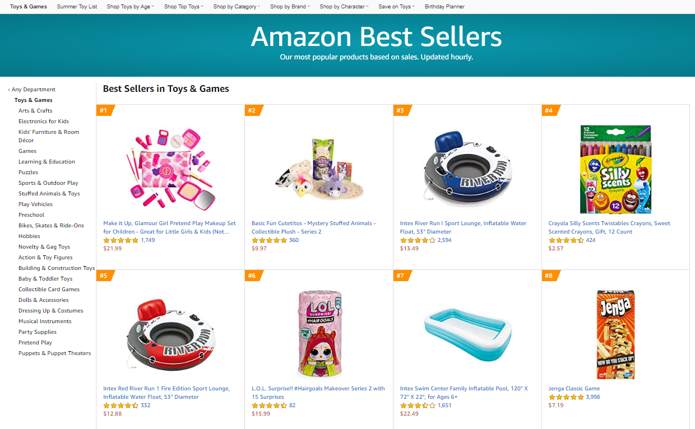
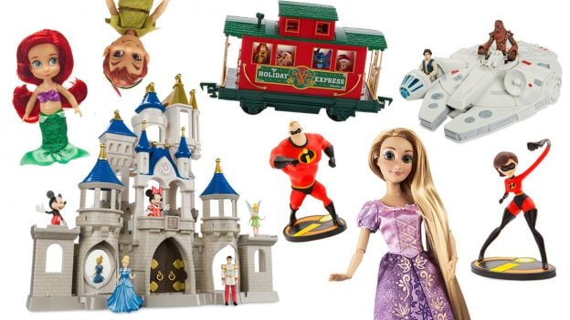
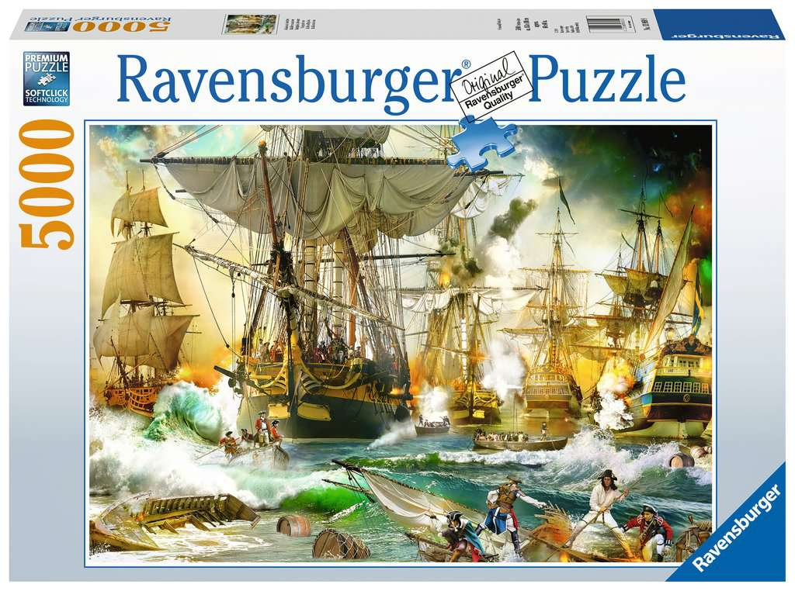

```{r setup, include=FALSE}
# You should put here any libraries that you will use in your data analysis.
library(tidyverse)
library(knitr)

amazon <- read.csv("amazon.csv")

# Some people may need to use the .Rds dataset if the .csv doesn't load properly
# amazon <- readRDS("amazon.Rds")
```

```{r, echo=FALSE, out.width="100%", fig.cap="Amazon Toys^[Image credit: https://www.business2community.com/ecommerce/the-most-profitable-product-categories-on-amazon-02244096]"}

```

# Assignment Background

Amazon is one of the largest and most profitable companies in the world and is especially popular for selling children's toys. Consider yourself an analyst hired by a major Chinese toy company that is considering expanding overseas and selling on Amazon. You are given a database of toys sold on Amazon and need to consider whether your client's higher quality, name brand, toys will sell enough on Amazon to be worth the effort of expansion. To do this, you will analyze the products of some of their major competitors. The dataset is courtesy of [Yam Peleg](https://www.kaggle.com/yamqwe/fashion-products-on-amazon-come)

# Assignment Instructions

- Save this document as a new document (Save As...) and rename it `Homework 2 Answers`. 
- Delete the Assignment Background and Assignment Instructions sections.
- If I say "Interpret..." that means I want at least 1-2 good quality sentences that show that you really understand the output of what R has produced. Short, incomplete sentences that fail to demonstrate you understand your output will have points deducted.
- Remember to appropriately label all of your graphs, construct easy to read tables, and nicely format your document. While the homework isn't a published document, it is the final product of exploratory data analysis so should be written as if you are presenting it to someone not familiar with the dataset.

# Part 1: Must submit for checking by Tuesday, February 22nd at 11:59 pm

## Setup

In this analysis, we will focus primarily on the variables `price`, `average_review_rating` and `number_of_reviews`. You will need to clean up these variables (they are stored in a `character` format). You can find advice about how to clean up these strings [here](https://readr.tidyverse.org/reference/parse_number.html). In this assignment, you should treat the entire dataset as the population.

## Q1: Literature review (5 points)

Find a news article online that discusses which toys are popular and which items are generally popular on Amazon (both in terms of sales and customer reviews). Read and comment on a few other articles that other students have posted. Based on these articles, what should we expect to find in this dataset and why? Make a bulleted list below with specific expectations according to the data we have in our dataset.

## Q2: Confidence intervals (30 points)

You, as a researcher, are interested in whether Disney produces higher quality products than other Amazon producers. A high quality product might be one where the average review score is above 4.8.

```{r, echo=FALSE, out.width="100%", fig.cap="Courtesy of Disney"}

```

### Q2a: Proportion of Disney products with an average review higher than 4.8

* Find the 95% confidence interval of the proportion of toys from the manufacturer `Disney` that have a review higher than 4.8 - calculate this by hand and show your work
* Check the conditions of the confidence interval
* Interpret your confidence interval
* What sample size would you need to say with 95% confidence that true proportion lies within a plus/minus 0.05 range?

### Q2b: Number of reviews

* Find the 90% confidence interval of proportion of toys from the manufacturer `Disney` that have at least 10 reviews - calculate this by hand and show your work
* Check the conditions of the confidence interval
* Interpret your confidence interval

### Q2c: Price

* Make a histogram of the price of the toys from Disney - what does this histogram indicate about the suitability of the data for making a confidence interval of price of toys from Disney?
* Find the 95% confidence interval of price of the toys - calculate this by hand
* Check the conditions of the confidence interval
* Interpret your confidence interval
* How much larger would $n$ have to be to decrease by a factor of two the size of your confidence interval?
* Practically speaking, what does this confidence interval and the preceding two confidence intervals tell us about the likely quality of products from Disney?

### Q2d: Bootstrapping a confidence interval

* Using the existing data, create a 95% bootstrapped confidence interval for the price of products from Disney and show the code you used to create the bootstrapped confidence interval
* Compare the results of the bootstrapped confidence interval (with 100000 samples) to you calculated by hand in Q2c - what can you conclude from the difference?
* When would using the bootstrap method be helpful? When would the regular confidence interval be more useful?

# Part 2: Finish by assigment deadline on February 27th at 11:59 pm
    
## Q3: Hypothesis testing (25 points)

Now let's turn to the toys from the manufacturer `LEGO`

```{r, echo=FALSE, out.width="100%", fig.cap="Courtesy of LEGO"}

```

### Q3a Proportion of reviews above 4.8

* Write a specific hypothesis, fully specified, as to whether the proportion of reviews for `LEGO` products that are above 4.8 are different from the population at an alpha of 0.05.
* What do you think is a reasonable critical value to select in this case? Choose your own critical value for your hypotheses tests.
* In this case should you use a one-sided test or two-sided test? 
* Does this test pass the conditions for a hypothesis test?
* Find the $p$ value for the difference and interpret it with respect to your hypothesis test.
* What are some possible lurking variables that might make our conclusion unreliable?

### Q3b Average price

* Write out a specific hypothesis, fully specified with correct notation, as to whether the average price for `LEGO` products are higher than the population at an alpha of 0.10.
* If we observed that the average price is different from the population mean at $p$=0.06, should we reject the null hypothesis? Why or why not?
* Does this test pass the conditions for hypothesis testing? 
* Find the $p$ value for whether the price of `LEGO` products is higher than population mean. 
* What are some possible lurking variables that might make our conclusion unreliable?
* What can you conclude about `LEGO` products from these two tests?
  
## Q4: Hypothesis testing wisdom (25 points)

Now we consider toys from the popular German game company Ravensburger.

```{r, echo=FALSE, out.width="100%", fig.cap="Courtesy of Ravensburger"}

```

### Q4a Ravensburger average review 

* Write out the hypothesis for whether the average review is different than the population mean for average reviews
* If we fail to reject the null hypothesis in this case, does that mean that the null hypothesis is true? Why?
* In your opinion, what $p$ value would you need to see to reject the null hypothesis
* Based on the previous question, what would you set the alpha level to?
* Let's say the data suggests that you should reject the null hypothesis. What size of difference in average review would you need to see to feel there is a *practically* significant difference? 
* By hand (show work), calculate your hypothesis test and interpret the results.

### Q4b Ravensburger product price

* Write out the hypothesis for whether the price of Ravensburger products is higher than the average price of toy products
* Explain what the difference between a Type I and a Type II error is here
* Which error type do you think would be more serious for a market analyst trying to understand if there is special appeal for this company's products? Why?
* What are two ways we could reduce the possibility of a Type I error? What are the reasons we may not take those actions to reduce the error?
* What is the power of this test?
* How large would a difference have to be to 'matter' in the context of being a market analyst?
* By hand (show work), calculate your hypothesis test and interpret the results. 

## Q5 Two sample $t$ and $z$ test (25 points)

Now let's compare the different company's products we explored earlier.

### Proportion of high quality products of LEGO vs. Disney (4.8+ stars)

* Write appropriate hypotheses that the difference in ratings between the two companies is not zero.  
* Are the assumptions and conditions necessary for inference satisfied?  
* Test the hypothesis and state your conclusion.  
* Explain in this context what your $p$ value means.  
* What type of error might your hypothesis conclusion be making? How could you correct for it?  
* Create a 95% confidence interval for the difference.
* Interpret your interval from a statistical perspective and explain its practical meaning.  

### Price of Ravensburger products vs. LEGO products

* Write out the hypothesis for whether there is a difference in the price of LEGO vs. Ravensburger products. 
* Are the assumptions and conditions necessary for inference  satisfied? Explain. 
* In this case, should you be using pooled variance?
* Create a 95% confidence interval for the difference.
* Interpret your interval in this context.  
* What are some reasons that the conclusions you draw from this test might not be valid?.

## Q6: Putting it all together (15 points)

Through the analysis conducted in the previous section **and through at least one additional investigation of your own (an additional graph, table, or calculation)**, write at least two to three paragraphs outlining what you think are the main findings from Q1-Q5 and your own additional analysis. Based on these results, what would you recommend to a large, well known toy manufacturer considering listing their products on Amazon? What information are we missing in this dataset that we would need to better understand whether this manufacturer should try to compete on this platform?
