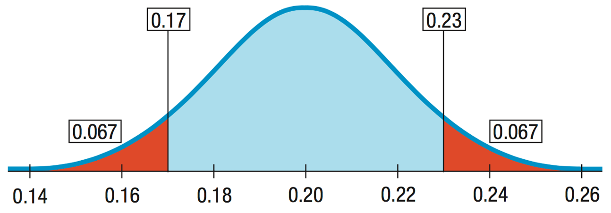
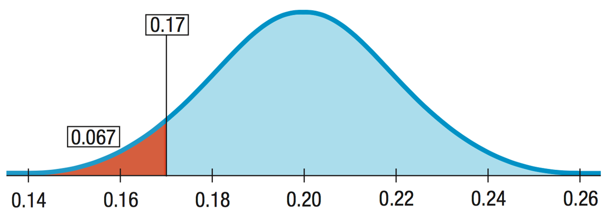
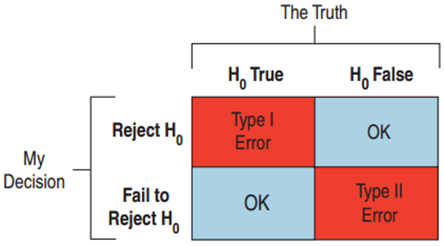
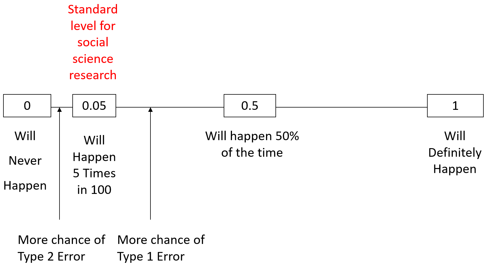

```{r setup, include=FALSE}
knitr::opts_chunk$set(echo = FALSE)
knitr::opts_chunk$set(warning = FALSE)
knitr::opts_chunk$set(message = FALSE)
library(tidyverse)
library(knitr)
library(broom)
library(gridExtra)
library(scales)
library(learnr)

theme_set(theme_classic())

classroster <- read.csv("www/classroster.csv", fileEncoding="UTF-8-BOM")

set.seed(8675309)
options(scipen=999)

vineyards <- read.csv("www/vineyards.csv")

vineyards <- vineyards %>%
  mutate(hectares = Acres/2.471)

hectares.sd <- round(sd(vineyards$hectares), digits=1)
hectares.mean <- round(mean(vineyards$hectares, digits=1))
hectares.crit.val <- round(qt(0.975, 35), digits=3)
hectares.se <- round(sd(vineyards$hectares)/sqrt(length(vineyards$hectares)), digits=1)
hectares.moe <- round(qt(0.975, 35)*sd(vineyards$hectares)/sqrt(length(vineyards$hectares)), digits=1)
hectares.tdiff <- (19.8-mean(vineyards$hectares))/(sd(vineyards$hectares)/sqrt(length(vineyards$hectares)))
```

# Hypothesis testing wisdom

* $t$ vs. $z$
* Choosing the right hypothesis test
* Interpreting $p$ values
* Alpha levels and critical values
* Practical vs. statistical significance
* Errors

## $t$ vs. $z$

### $t$ vs. $z$ test

Know $\sigma$ Variable is continuous                                    Variable is proportion
------------- ----------------------                                    ----------------------  
Yes           $z\times SD_{samplingdist}=z\frac{\sigma}{\sqrt{n}}$      $z\times SD_{samplingdist}=z\sqrt{\frac{pq}{n}}$  
No            $t_{df}\times SE=t_{df}\frac{s}{\sqrt{n}}$                Depends on CI vs. hypothesis test

### When to use true population parameter

Know $\sigma$ Hypothesis test                                  Confidence interval
------------- ---------------                                  -------------------
Yes           $pq$ from null                                   If sample is representative, $pq$
              $z\times SD_{samplingdist}=z\sqrt{\frac{pq}{n}}$ $z\times SD_{samplingdist}=z\sqrt{\frac{pq}{n}}$
No            $pq$ from null                                   Use $\hat{p}\hat{q}$
              $z\times SE=z\sqrt{\frac{pq}{n}}$                $z\times SE=z\sqrt{\frac{\hat{p}\hat{q}}{n}}$

## Choosing the right hypothesis test

### Alternatives - two sided

```{r twosidedpic, echo=FALSE, out.width="100%", fig.cap="Two sided test"}

```

### Alternatives - two sided

* Old rate is 20%. $H_0: p = 0.20$

* Error could be in either direction $H_A: p \neq 0.20$

### Alternatives - one sided

```{r onesidedpic, echo=FALSE, out.width="100%", fig.cap="One sided test"}

```

### Alternatives - one sided

* Interested only in a decrease in the rate: $H_A: p < 0.20$

* One-sided alternative

### Alternatives - one sided

* One-sided: $p$ value is probability only in the direction of the alternative away from the null hypothesis value.
* One-sided $p$ value is half the two-sided $p$ value.
* One-sided test will reject the null hypothesis more often.
* Great that it rejects the null hypothesis more often when it is false but not so much when it rejects it more often when it is true!
* Two-sided rejects less often
* So use two-sided unless you can justify using one-sided
* Advantage of two-sided test is results matched to CI.

## Confidence interval test

* Two ways to test a hypothesis
* Way 1: Construct CI, assume null is true, evaluate: is your value a likely mean of null quantity
  + Select $null$
  + Select critical value of $t_{df}$
  + $t_{df}SE$ or $t_{df}\frac{s}{\sqrt{n}}$
  + CI: $null\pm t_{df}SE$
  + Is your observed value within the CI?
    - If yes, value consistent with null
    - If no, reject null

### Example: vineyards

```{r ssvpic, echo=FALSE, out.width="100%", fig.cap="My family's vineyard"}

```

### Example: vineyards

```{r fingerlakesmap, echo=FALSE, out.width="100%", fig.cap="Finger Lakes wine district"}

```

### Example: vineyard size

* Select null: $hectares_{null} = 19.8$
* Select critical value of $t_{df} = 0.05$
* $t_{df}\times SE$ or $t_{df}\frac{s}{\sqrt{n}}=`r hectares.crit.val`\frac{`r hectares.sd`}{\sqrt{`r length(vineyards$hectares)`}}$
* $\bar{y}=`r hectares.mean`$
* CI: $`r hectares.mean`\pm`r hectares.moe`$
* Is the null value within the CI?
* Null: $19.8$, yes within CI
* Cannot reject null

## $p$ value test

* Way 2: Estimate the specific likelihood of observing your mean if we expect the null hypothesis to be true
  + Select null
  + Set critical value derived from $t_{df}$
  + $tscore_{difference}=\frac{null-observed}{SE}$
  + Look up $p$ value of that $t$ score given your $df$ $\rightarrow$ that is how unlikely your sample mean is assuming null is true
  + Compare to cutoff value
  + If $p$ smaller than the cutoff value, your sample mean is too unlikely $\rightarrow$ reject null
  + If $p$ larger than cutoff value, your sample mean is within the likely values of  the null; do not reject null

### Example: vineyard size

* Select null: $hectares_{null} = 19.8$
* Set critical value derived from $t_{df}  = 0.05$
* $tscore_{difference}=\frac{19.8-`r hectares.mean`}{`r hectares.se`}=`r round(hectares.tdiff, digits=3)`$
* Look up p value of that t score given your df $\rightarrow$ that is how unlikely your sample is assuming null is true

```{r hectarestestpval, exercise=TRUE}
pt(hectares.tdiff, df=(length(vineyards$hectares)-1))
```

* Compare to cutoff value: 0.025 < `r round(pt(hectares.tdiff, df=(length(vineyards$hectares)-1)), digits=3)` < 0.975 $\rightarrow$ cannot reject null

### Interpretation

* Either provides you with same information; how likely is your sample to be the same as $H_0$ 

* CI specifies the range of likely values 

* $p$ value specifies the specific likelihood

* Practically, $p$ value often more important
    + You can set a cutoff value but reader also needs to know how unlikely your result is
    + Maybe they think another cutoff value more important

## Interpreting $p$ values

### $p$ value is a conditional probability

* The $p$ value is the probability of getting results as unusual as observed given that $H_0$ is true.
  + $p value = p(observed\ statistic | H_0\ is\ true)$
  + $p value\neq p(H_0\ is\ true | observed\ statistic)$
* The $p$ value never gives a probability that $H_0$ is true.
  + $pvalue = 0.03$ does not mean a 3% chance of $H_0$ being correct. 
  + It just says that if $H_0$ is correct, then there would be a 3% chance of observing a statistic value more unlike what was observed.

### Small $p$ values

* A smaller $p$ value provides stronger evidence against $H_0$.
  + This does not mean that $H_0$ is less true.
  + The person is not more guilty, you just are more convinced of the guilt.
* There is no hard and fast rule on how small is small enough.
  + How believable is $H_0$?
  + Do you trust your data?

### How guilty is the suspect?

* A bank robbery trial:
  + Both robber and defendant are male and same height and weight.
    - $p$ value getting smaller
  + Robber wore blue jacket like one found in trash near defendant’s house.
    - $p$ value still smaller

* Evidence rolls in, $p$ value small enough, "beyond reasonable doubt"
    + However, does not make him any guiltier
    + Just more confident that made right decision

## Alpha levels and critical values

### How to define “rare enough”

* Need to make a decision whether $p$ value is low enough to reject $H_0$.

* Set a threshold value, called the alpha level ($\alpha$).

* $pvalue < \alpha$:
  + Reject $H_0$.
  + The results are statistically significant (may not be practically significant!!)

* Common $\alpha$ levels are 0.10, 0.05, 0.01, and 0.001.

* 0.05 is often used.

* Select $\alpha$ level before collecting data.

### Significance level

* $\alpha$ is also called the significance level.

* When reject null hypothesis, test is "significant at that level"

* Reject the null hypothesis "at the 5% significance level"

* Automatic nature may be uncomfortable

* $p$ value slightly above alpha level, not allowed to reject the null

* $p$ value slightly below the alpha level leads to rejection

* If this bothers you, you’re in good company.

* Report the $p$ value.

### Critical value

* For every null model, an $\alpha$ level specifies an area under the curve
* The cutpoint for that area is called a critical value.
* Normal model: critical value is $z^*$
* $t$ model: critical value is $t^*$
* We have used critical values of 1, 2, and 3 when we talked about the 68-95-99.7 Rule.
* Likely to choose $\alpha$ levels like 0.1, 0.05, 0.01, or 0.001, with corresponding $z^*$ critical values of 1.645, 1.96, 2.576, and 3.29.
* For a one-sided alternative, divide the $\alpha$ level in half.

## Practical vs statistical significance

### Practical vs statistical significance

* Statistical significance
  + $pvalue < \alpha$
  + If you don’t know the $\alpha$ level, then you don’t know what “significant” means.
  + Sometimes used to suggest meaningful or important.
  + Test with small $p$ value may be surprising
  + But says nothing about the size of the effect
  + That’s what determines whether the effect makes a difference.
  + Don’t be lulled into thinking a statistical significance carries with it any sense of practical importance.

### Effect size

* Practical significance
  + Reject null hypothesis – care about the actual change or difference in the data
  + **Effect size** – difference between data value and null value
  + Large samples – even a small, unimportant effect size can be statistically significant
  + Sample not large enough – even a large financially or scientifically important effect may not be statistically significant
  + Report CI, $p$ value – indicates range of plausible values
  + CI centered on the observed effect, puts bounds on how big or small the effect size may actually be

## Hypothesis testing errors

### Type I and Type II errors

```{r typeerrors, echo=FALSE, out.width="100%", fig.cap="Type I and Type II errors"}

```

### Type I and Type II errors

* Type I Error
  + Reject $H_0$ when $H_0$ is true.

* Type II Error
  + Fail to reject $H_0$ when $H_0$ is false.
  
* Medicine: such as an AIDS test
  + Type I Error $\rightarrow$ false positive: patient thinks he has the disease when he doesn’t.
  + Type II Error $\rightarrow$ false negative: patient is told he is disease - free when in fact he has the disease.

* Jury Decisions
  + Type I: found guilty when the defendant is innocent. Put an innocent person in jail.
  + Type II: not enough evidence to convict, but was guilty. A murderer goes free.

### Type I and Type II errors

* As usual, when we conduct a statistical test of significance, we make a statement whether we can accept or reject the null hypothesis at some confidence level (usually 0.05)

* We may be right or wrong – we never know the true state of the world, only the information obtained in our sample

### Type I and Type II errors 

* So why not just set significance level at some very high level then? Why not only accept at the 0.001 level?

* Setting a cutoff is actually a tradeoff between Type I vs. Type II statistical errors

* If a researcher claims support for the research hypothesis with a significant result when, in fact, variations in results are caused by random variables alone, then a **Type I error** is said to have occurred.

* Through poor design or faulty sampling, researchers may fail to achieve significance, even though the effect they were attempting to demonstrate actually does exist. In this case it would be said that they had made a **Type II error**.

### Type I and Type II errors

```{r standardcutoffs, echo=FALSE, out.width="100%", fig.cap="Probability continuum"}

```

### Probabilities of Type I and Type II errors

* $p(Type\ I\ Error) = \alpha$
  + This represents the probability that if $H_0$ is true then we will reject $H_0$
  
* $p(Type\ II\ Error) = \beta$
  + We cannot calculate $\beta$. Saying $H_0$ is false does not tell us what the parameter is
  
* Decreasing $\alpha$ results in an increase of $\beta$

* Reduce $\beta$ for all alternatives, by increasing $\alpha$

* The only way to decrease both is to increase the sample size

### Example: thinking about errors

* The study found patients who took a certain drug to help with diabetes management have an increased risk of heart attack.

* What kind of error if their findings were due to chance?

* $H_0$ is true but they rejected $H_0$.
    + Type I error

* Patients would be deprived of the diabetes drug’s benefits when there is no increased risk of heart attack.

## Power of a test

* What we really want to do is to detect a false null hypothesis.

* When $H_0$ is false and we reject it, we have done the right thing.

* A test’s ability to detect a false null hypothesis is called the power of the test.

* Power  =  1 – $\beta$

* If a study fails to reject $H_0$, either:
  + $H_0$ was true. No error was made.
  + $H_0$ is false. Type II error was made.
  + Jury trial, power: ability of criminal justice system to convict people who are guilty—a good thing!

### Example: errors and power

* The meta study resulted in a larger study of 47 different trials.

* How could this larger sample size help?

* If the drug really did increase the chance of heart attack, doctors needed to know.

* Missing this side effect would be a Type II error.

* Increasing the sample size increases the power of the analysis, increasing the chance of detecting the danger if there is one.

### Effect size

* For same sample size, larger effect size results in higher power

* A small effect size is difficult to detect, high probability of Type II error, lower power

* Power depends on effect size and standard deviation.

* The effect size depends on "How big a difference would matter?"
  + In detecting the “human energy field” would a 53% or a 75% success rate be remarkable?

### Effect size

* When designing an experiment, need to know what effect size would be meaningful
  + Important to specify this **before** conducting your study/experiment
  
* Also useful to have an expectation about how variable your data are likely to be	

* With those estimates, and a little algebra, you can get an estimate of your required $n$

* To know how variable the data may be, you may need to run a "pilot" study or base calculations on previous similar studies.

* If you fail to reject $H_0$ hypothesis, then consider whether test had sufficient power.

### Example: sample size, errors, and power

* The diabetes drug manufacturer looked at the study and rebutted that the sample size was too small.

* Why would this smaller study have been less likely to detect a difference in risks?
  + Small studies have more sampling variability.
  + Small studies have less power.
  + Hard to discern whether the difference is due to chance:  Higher $p(Type\ II)$, since $p(Type\ I)$ is fixed by the FDA.
  + Large studies can reduce the risk of both errors.
  + Larger studies are better but very expensive.
