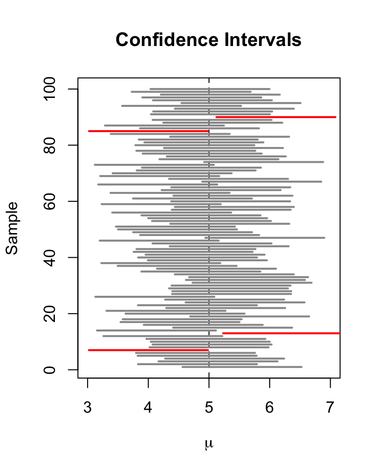

```{r setup, include=FALSE}
knitr::opts_chunk$set(echo = FALSE)
knitr::opts_chunk$set(warning = FALSE)
knitr::opts_chunk$set(message = FALSE)

library(tidyverse)
library(knitr)
library(broom)
library(gridExtra)
library(learnr)

theme_set(theme_classic())

classroster <- read.csv("www/classroster.csv", fileEncoding="UTF-8-BOM")

set.seed(8675309)
n.example <- 100

mean.multiple.samples <- function(numdraws, numsamples, variable) { 
     meanvector <- c() 
     meanonesample <- 0 
     for (i in 1:numsamples) { 
	   meanonesample <- mean(sample(variable, numdraws, replace=TRUE)) 
         meanvector[i] <- meanonesample 
     } 
     meanvector 
}

kc.house <- read.csv("www/kc.house.data.original.csv")

kc.house <- kc.house %>%
  mutate(is.three.bedrooms = ifelse(bedrooms==3, 1, 0)) 

sampling.distribution <- mean.multiple.samples(100, 100000, kc.house$is.three.bedrooms)
normal.sampling.distribution <- rnorm(100000)
skewed.population <- sample(c(1, 0), 100000, replace=TRUE, prob = c(0.001,0.999))
skewed.sample <- mean.multiple.samples(100, 100000, skewed.population)

sample.once <- sample(kc.house$is.three.bedrooms, 100, replace=TRUE)
p<-round(mean(sample.once), digits=3)
```

# Confidence Intervals

* The sampling distribution model for a proportion

* When does the normal model work?

* Confidence interval for a proportion

* Interpreting confidence intervals

* Margin of error: certainty vs. precision

## The sampling distribution model for a proportion

### Sampling model

* Draw samples at random, $n=100$

* Samples vary

* Can’t draw all samples of size 100, astronomical

* Draw a few thousand samples

* Distribution is called the sampling distribution of the proportion.

What shape do you think the sampling distribution will have if we have sample size $n=100$?

```{r picker1, exercise=TRUE}
sample(classroster$name, 1)
```

### Graph of a **sampling** distribution

* Remember, this is not a graph of the **actual** distribution

```{r samplingplot, exercise=TRUE}
ggplot(data.frame(sampling.distribution), aes(x=sampling.distribution)) +
  geom_density(color="darkblue", fill="lightblue", adjust=2) + 
  labs(x="Sample mean of % of houses with 3 bedrooms", y="Count") +
  geom_vline(xintercept=mean(sampling.distribution), color="red") + 
  theme(axis.text.x = element_text(face="bold", size=10))
```

### Random matters

* Sampling distribution for a proportion

  + Symmetric - check  

  + Unimodal - check  

  + Centered at $p$: **`r round(mean(sampling.distribution), digits=3)`** 

  + Standard deviation: **`r round(sd(sampling.distribution), digits=3)`**

  + Follows the Normal model - check  

### The Normal model for sampling

* Samples don’t all have the same proportion.

* Normal model is the right one for sample proportions.

* Modeling how sample statistics, proportions or means, vary from sample to sample is powerful.

* Allows us to quantify that variation.

* Make statements about corresponding population parameter.

* Make model for random behavior, then understand and and use that model.

### Whicn Normal model to choose?

* Reminder: normal model is $N(\mu, \sigma^2)$

* $\mu$ or mean is $p$, or the proportion we want to estimate, $n$ is sample size

* For proportions, $\sigma(p) = \sqrt{\frac{p(1-p)}{n}}$

* This is the standard deviation of the **SAMPLING DISTRIBUTION**, that is the distribution of $p$ across infinite samples

### Mean and standard deviation

```{r meansdplot, exercise=TRUE}
ggplot(data.frame(normal.sampling.distribution), aes(x=normal.sampling.distribution)) + 
  geom_density(color="darkblue", fill="lightblue") +
  scale_x_continuous(breaks=c(-3, -2, -1, 0, 1, 2, 3),
                     label=c("-3sqrt(pq/n)", "-2sqrt(pq/n)", "-1sqrt(pq/n)", "0sqrt(pq/n)", "1sqrt(pq/n)", "2sqrt(pq/n)", "3sqrt(pq/n)"), 
                     limits=c(-3, 3),
                     guide = guide_axis(n.dodge=2)) +
  labs(x="Normal model distances for proportions", y="Density") + 
  theme(axis.text.x = element_text(face="bold", size=10))
```

### Reminder - Normal model rule

* Using this normal model rule, we can tell how likely it is to have a certain $\hat{p}$ given the sampling distribution normal model

* Remember the 68–95–99.7 (1 sd, 2 sd, 3 sd), for other distances use technology

* Most common: 95% of samples have sample proportion within two standard deviations of the true population proportion.

* Knowing the sampling distribution tells us how much variation to expect

* Called the sampling error in some contexts

* Not really an error, just variability

* Better to call it sampling variability

## When does the normal model work?

* Independence Assumption: check data collected in a way that makes this assumption plausible

* Randomization Condition: subjects randomly assigned treatments, or survey is simple random sample

* 10% Condition: sample size less than 10% of the population size

* Success Failure Condition: there must be at least 10 expected successes and failures. $n\hat{p}\geq10$ and $\hat{n}p\geq10$

### When does the normal model fail for the sampling distribution?

* $p$ close to 0 or 1

* People in this class that can dunk a basketball

* Sample size 100
    + If true $p = 0.001$, then probably none in sample of 100

* If we simulated samples of size 100 with $p = 0.001$
    + Distribution skewed right, can't rely on normal model percentages anymore
    
* $n$ is fine, but $p$ is too small

What will the shape of the sampling distribution look like if $p = 0.001$?

```{r picker2, exercise=TRUE}
sample(classroster$name, 1)
```

### Example simulation

```{r skewsamplingplot, exercise=TRUE}
ggplot(data.frame(skewed.sample), aes(x=skewed.sample)) +
  geom_density(color="darkblue", fill="lightblue") + 
  labs(x="Sample mean of those who can dunk with sample size = 100", y="Count")
```

### Class sampling exercise

* We know that about 50% of students at DKU plan to or have selected a major in the natural sciences

* ? % of students in our class plan to major in the natural sciences in our class
  + Is our class unusually small?
  
* Check conditions
  + Randomization condition
  + 10% condition
  + Success failure condition
  
### Find how far we are from the population mean

* Population standard deviation formula is:
  + $\frac{\sqrt{p(1-p)}}{\sqrt{n}}$
  + $\hat{p}$ is the proportion of yeses
  + $n$ is the sample size
  
* We are calculating using the population **sampling** $SD$ since we know it
  + If we don't know the population sampling $SD$ we have to use a different strategy, but not the case here

* Knowing the $SD$, we can create a z score for the difference between our class and the population
  + z score is how many $SD$s our class is from the population mean
    - $(class score - dkumean) / SD$

### Normal distribution percentages

```{r normalpercentiles, exercise=TRUE}
ggplot(data.frame(normal.sampling.distribution), aes(x=normal.sampling.distribution)) + 
  geom_density(color="darkblue", fill="lightblue") +
  scale_x_continuous(breaks=c(-3, -2, -1, 0, 1, 2, 3),
                     label=c("~0.005", "~0.025", "~0.16", "0.5", "~0.84", "~0.95", "~0.995"), 
                     limits=c(-3, 3),
                     guide = guide_axis(n.dodge=2)) +
  labs(x="Cumulative density", y="Density") +
  theme(axis.text.x = element_text(face="bold", size=10))
```

### Calculation for our class

* $\frac{\sqrt{p(1-p)}}{\sqrt{n}}$

* $\hat{p}$ is the proportion of yeses

* $n$ is the sample size

* $\frac{\hat{p} - p}{SD(p)}$ 

* 68-95-99.7 Rule:  Values ?$SD$ above the mean occur less than ?% of the time. Our class mean appears to be far/near from the population mean

Calculate the how likely our result would be if our class is a random sample of DKU students.

```{r picker3, exercise=TRUE}
sample(classroster$name, 1)
```

## Confidence intervals of proportions

### Standard errors for proportions

* What is the sampling distribution?

* Usually we do not know the population proportion $p$.

* Therefore, we cannot find the standard deviation of the sampling distribution $\frac{\sqrt{p(1-p)}}{\sqrt{n}}$

* After taking a sample, we only know the sample proportion, which we use as an approximation (called the standard error)
  + $\frac{\sqrt{\hat{p}(1-\hat{p})}}{\sqrt{n}}$

### Example: bedrooms

* Draw a random sample of 100 houses

```{r randomsample, exercise=TRUE}
#sample.once <- sample(kc.house$is.three.bedrooms, 100, replace=TRUE)
#p<-round(mean(sample.once), digits=3)

p
```
 
* $\frac{\sqrt{\hat{p}(1-\hat{p})}}{\sqrt{100}}$

* The sampling distribution should be approximately normal

### What is a confidence interval?

* Confidence interval: a way to express the range of plausible values for the parameter (in this case, percent of homes with three bedrooms)

* We never know the true value but we want to say something about how wide the range of possible values are

* What is a reasonable range?
  + Traditionally, 95% (about two standard deviations) of the standard error distribution
  + Mean of our sample $\pm$ range of possible values we could get if we took additional samples

### Example: bedrooms

* Our mean: `r round(mean(sample.once), digits=3)`

* Our **estimated** sampling distribution standard error: 
  + $\sqrt{\frac{\hat{p}(1-\hat{p})}{`r n.example`}}$
  + $\sqrt{\frac{\hat{`r p`}(1-\hat{`r p`})}{`r n.example`}}$
  + $\sqrt{\frac{`r p*p`}{100}}$
  + $\sqrt{`r p*p/100`}$
  + $`r sqrt(p*p/100)`$
  
* A range of reasonable values if we sampled this again:
  + $2\times`r sqrt(p*p/100)`$
  + $`r p`\pm`r 2*sqrt(p*p/100)`$

Statement: we are ~95% confident that this interval contains the true proportion of houses with three bedrooms in the population

### Critical values

* Critical values are the cutoff we use to determine what is 'reasonable'

* Derived from the Normal model

* Can use any z-score as a cutoff

* Corresponding multiplier of the SE is called the critical value.

* Normal model for this interval, it is denoted $z^*$.

* To find, need to use computer, calculator, Normal probability table

```{r normpercents, exercise=TRUE}
qnorm(c(0.025, 0.975))
```
 
### Recap

* Make sure conditions are met, then find level C confidence interval for $\hat{p}$, our population mean estimate

* Confidence interval is defined as $\hat{p}\pm z^* \times SE(\hat{p})$

* $SE(\hat{p})$ estimated by $\frac{\sqrt{\hat{p}(1-\hat{p})}}{\sqrt{n}}$

* $z^*$ specifies number of SEs needed for C% of random samples to yield confidence intervals that capture the true parameter

### What you cannot say about $p$ from the sample

1. "`r p` of all houses in King County have three bedrooms." 
  + No. Observations vary. Another sample would yield a different sample proportion.

2. "It is probably true that `r p` of all houses in King County have three bedrooms." 
  + No again. In fact, even if we didn’t know the true proportion, we’d know that it’s probably not `r p`.

### What you cannot say about $p$ from the sample

3. "We don’t know exactly what proportion of houses in King County have three bedrooms, but we know that it’s within the interval $`r p`\pm2\times`r sqrt(p*p/100)`$.”   
  + No but getting closer. We don't know this for sure. 
  
4. "We don’t know exactly what proportion of houses in King County have three bedrooms, but the interval from `r round((p-(2*sqrt(p*p/100))), digits=3)` to `r round((p+(2*sqrt(p*p/100))), digits=3)` probably contains the true proportion."
  + Right but can be more precise. We should specify how confident we are not just say *probably*
  
### What you can say about $p$ from the sample

5. "We are 95% confident that between `r round((p-(2*sqrt(p*p/100))), digits=3)` and `r round((p+(2*sqrt(p*p/100))), digits=3)` of houses in King County have three bedrooms." 
  + Statements like these are called confidence intervals. They’re the best we can do.

### Naming the confidence interval

* This confidence interval is a one-proportion z-interval.

  + "One" since there is a single mean being calculated.
  + "Proportion" since we are interested in the proportion of the population.
  + "z-interval" since the distance of the interval relies on a normal sampling distribution model.

## Interpreting confidence intervals

### Capturing a proportion

* The confidence interval may or may not contain the true population proportion.

* Consider repeating the study over an over again, each time with the same sample size.

* Each time we would get a different $\hat{p}$

* From each $\hat{p}$, a different confidence interval could be computed.

* About 95% of these confidence intervals will capture the true proportion.

* 5% will be duds.

### Random matters - confidence intervals

* There are a huge number of confidence intervals that could be drawn.

* In theory, all the confidence intervals could be listed.
    + 95% will “work” (capture the true proportion).
    + 5% will be “duds” (not capture the true proportion).
    
* What about our confidence interval (`r round((p-(2*sqrt(p*p/100))), digits=3)`, `r round((p+(2*sqrt(p*p/100))), digits=3)`)?
    + In this case, we can find out the true value 
    + Most of the time we never know

```{r truemean, exercise=TRUE}
mean(kc.house$is.three.bedrooms)
```

### Random matters - confidence intervals



## Margin of error: certainty vs. precision

### Margin of error

* Confidence interval for a population proportion: $\hat{p} \pm 2\times SE(\hat{p})$

* The distance, $~2\times SE(\hat{p})$, from $\hat{p}$ is called the *margin of error*

* Confidence intervals can be applied to many statistics, not just means. Regression slopes and other quantities can also have confidence intervals.

  + In general, a confidence interval has the form **estimate** $\pm$ **margin of error**

### Certainty vs. precision

* Competing goals
  + More certainty, need to capture $p$ more often, need to make the interval wider.
  + More precise, need to provider tighter bounds on our estimate for $p$, need to make the interval narrower

* Instead of a 95% confidence interval, any percent can be used.
  + Increasing the confidence (e.g. 99%) increases the margin of error.
    - Need to make our range wider to make sure we don't 'miss' 
  + Decreasing the confidence (e.g. 90%) decreases the margin of error.
    - Need to make our range smaller so as to be more specific about our guess

### What sample size?

* Can increase both certainty and precision by increasing sample size

* For 95%, $z^*$ = 1.96

* Values that make ME largest are $\hat{p}=0.5$

* If we want to ensure, say, a **margin of error** of $<3%$
  + $ME = z\times \sqrt{\frac{\hat{p}(1-\hat{p})}{n}}$
  + $0.03 = 1.96\times \sqrt{\frac{(0.5)(0.5)}{n}}$
  
* Solving for $n$, gives $n\approx1067.1$

* We need to survey at least 1068 to ensure a ME less than 0.03 for the 95% confidence interval.

### Thoughts on sample size and ME

* Obtaining a large sample size can be expensive and/or take a long time.

* For a pilot study, $ME = 10%$ can be acceptable.

* For full studies, $ME < 5%$ is better.

* Public opinion polls typically use $ME = 3%$, $n = 1000$

* If $p$ is expected to be very small such as 0.005, then much smaller ME such as 0.1% is required.
  + Common in medical studies
