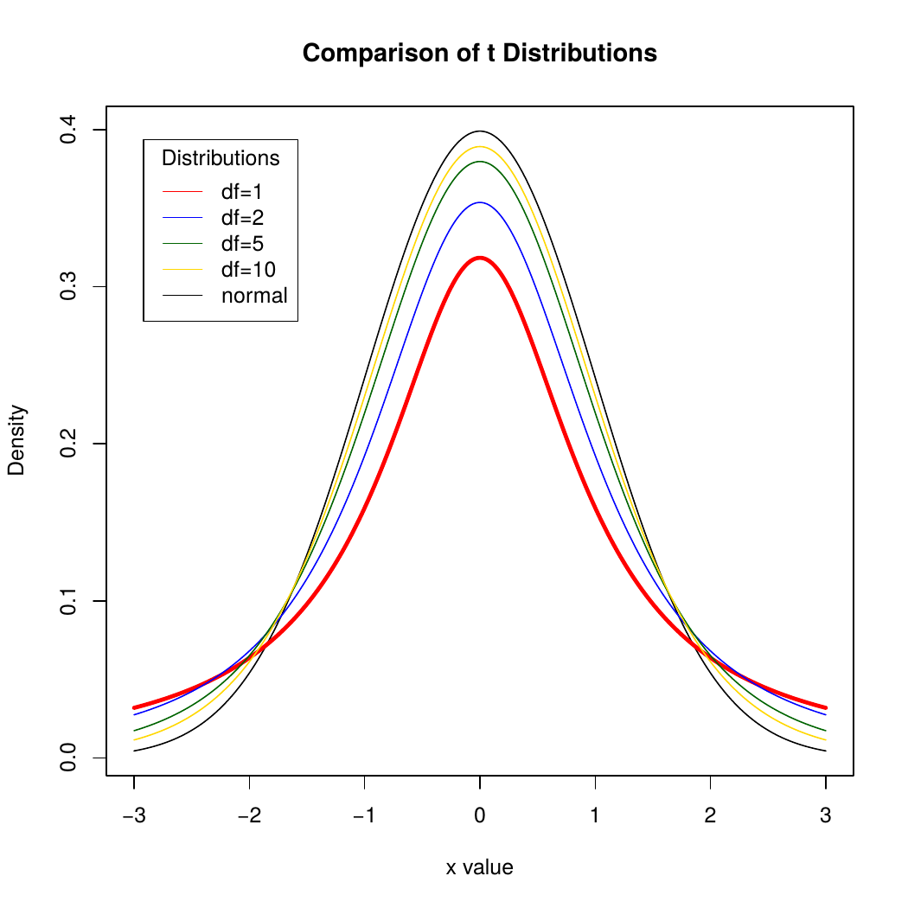

```{r setup, include=FALSE}
knitr::opts_chunk$set(echo = FALSE)
knitr::opts_chunk$set(warning = FALSE)
knitr::opts_chunk$set(message = FALSE)
library(tidyverse)
library(knitr)
library(broom)
library(gridExtra)
library(scales)
library(learnr)

theme_set(theme_classic())

set.seed(8675309)
options(scipen=999)

mean.multiple.samples <- function(numdraws, numsamples, variable) { 
     meanvector <- c() 
     meanonesample <- 0 
     for (i in 1:numsamples) { 
	   meanonesample <- mean(sample(variable, numdraws, replace=TRUE)) 
         meanvector[i] <- meanonesample 
     } 
     meanvector 
}

kc.house <- read.csv("www/kc.house.data.original.csv")
classroster <- read.csv("www/classroster.csv", fileEncoding="UTF-8-BOM")

sample20 <- sample(kc.house$price, 20, replace=TRUE)

upper.bound <- round((mean(sample20) + (qt(0.975,df=19) * sd(sample20) / sqrt(19))), digits=0)
lower.bound <- round((mean(sample20) - (qt(0.975,df=19) * sd(sample20) / sqrt(19))), digits=0)
```

# Confidence intervals - means

* The central limit theorem
* A confidence interval for the mean
* Interpreting confidence intervals
* Picking our interval up by our bootstraps
* Thoughts about confidence intervals

## House price revisited

* Prices in King County Houses:
  + `r as.numeric(kc.house %>% summarize(n=n()))` houses
  + Highly right skewed
  + Can define this as the entire population
  + Prices are quantitative

### House price graph

```{r pricedensity, exercise=TRUE}
ggplot(kc.house, aes(x=price)) +
  geom_histogram(aes(y=..density..),  fill="lightblue", color="darkblue") +
  labs(x="Price in USD", y="Density") +
  scale_x_continuous(labels=comma) +
  scale_y_continuous(labels=comma)
```

### Distribution

* Distribution:
  + Min: `r round(min(kc.house$price), digits=0)`
  + Q1: `r round(quantile(kc.house$price, probs=0.25), digits=0)`
  + Med: `r round(median(kc.house$price), digits=0)`
  + Q3: `r round(quantile(kc.house$price, probs=0.75), digits=0)`
  + Max: `r round(max(kc.house$price), digits=0)`
  + Mean: `r round(mean(kc.house$price), digits=0)`
  + SD: `r round(sd(kc.house$price), digits=0)`

* Highly right skewed

* SD almost as large as the median

* If a distribution looks like this, is it possible to take a sample and generate an accurate mean and confidence interval estimate?

```{r picker1, exercise=TRUE}
sample(classroster$name, 1)
```

## The central limit theorem

* The Central Limit Theorem
  + The sampling distribution of any mean becomes nearly Normal as the sample size grows.

* **Requirements**
  + Observations independent
  + Randomly collected sample

* The sampling distribution of the means is close to Normal if **either**:
  + Large sample size
  + Population close to Normal

### Samples = 100, $n$ = 200

```{r pricesmall, exercise=TRUE}
houses <- mean.multiple.samples(200, 100, kc.house$price)

ggplot(data.frame(houses), aes(x=houses)) +
  geom_histogram(aes(y=..density..),  fill="lightblue", color="darkblue") +
  geom_density(color="darkred", size=1) +
  labs(x="Price in USD", y="Density") +
  scale_x_continuous(labels=comma) +
  scale_y_continuous(labels=comma)
```

### Samples = 1000, $n$ = 200

```{r pricemedium, exercise=TRUE}
houses <- mean.multiple.samples(200, 1000, kc.house$price)

ggplot(data.frame(houses), aes(x=houses)) +
  geom_histogram(aes(y=..density..),  fill="lightblue", color="darkblue") +
  geom_density(color="darkred", size=1) +
  labs(x="Price in USD", y="Density") +
  scale_x_continuous(labels=comma) +
  scale_y_continuous(labels=comma)
```

### Samples = 100000, $n$ = 200

```{r pricelarge, exercise=TRUE}
houses <- mean.multiple.samples(200, 100000, kc.house$price)

ggplot(data.frame(houses), aes(x=houses)) +
  geom_histogram(aes(y=..density..),  fill="lightblue", color="darkblue") +
  geom_density(color="darkred", size=1) +
  labs(x="Price in USD", y="Density") +
  scale_x_continuous(labels=comma) +
  scale_y_continuous(labels=comma)
```

## Sampling distribution shape

* As number of samples taken goes to infinity, shape of the **sampling** distribution becomes more clearly normally shaped

* Doesn't matter the shape of the underlying distribution except for a very few exceptions

* How about holding samples fixed and changing $n$ in our sample of a skewed distribution?

### $n$ = 10

```{r sample10, exercise=TRUE}
houses <- mean.multiple.samples(10, 100000, kc.house$price)

ggplot(data.frame(houses), aes(x=houses)) +
  geom_histogram(aes(y=..density..),  fill="lightblue", color="darkblue") +
  geom_density(color="darkred", size=1) +
  labs(x="Price in USD", y="Density") +
  scale_x_continuous(labels=comma) +
  scale_y_continuous(labels=comma)
```

### $n$ = 25

```{r sample25, exercise=TRUE}
houses <- mean.multiple.samples(25, 100000, kc.house$price)

ggplot(data.frame(houses), aes(x=houses)) +
  geom_histogram(aes(y=..density..),  fill="lightblue", color="darkblue") +
  geom_density(color="darkred", size=1) +
  labs(x="Price in USD", y="Density") +
  scale_x_continuous(labels=comma) +
  scale_y_continuous(labels=comma)
```

### $n$ = 50

```{r sample50, exercise=TRUE}
houses <- mean.multiple.samples(50, 100000, kc.house$price)

ggplot(data.frame(houses), aes(x=houses)) +
  geom_histogram(aes(y=..density..),  fill="lightblue", color="darkblue") +
  geom_density(color="darkred", size=1) +
  labs(x="Price in USD", y="Density") +
  scale_x_continuous(labels=comma) +
  scale_y_continuous(labels=comma)
```


### $n$ = 100

```{r sample100, exercise=TRUE}
houses <- mean.multiple.samples(100, 100000, kc.house$price)

ggplot(data.frame(houses), aes(x=houses)) +
  geom_histogram(aes(y=..density..),  fill="lightblue", color="darkblue") +
  geom_density(color="darkred", size=1) +
  labs(x="Price in USD", y="Density") +
  scale_x_continuous(labels=comma) +
  scale_y_continuous(labels=comma)
```

### Central limit theorem formally

* When a random sample is drawn from any population with mean $\mu$ and standard deviation $\sigma$, its sample mean, $\bar{y}$, has a sampling distribution with the same mean    but whose *standard deviation* is $\frac{\sigma}{\sqrt{n}}$ and we write $\sigma(\bar{y})=SD(\bar{y})=\frac{\sigma}{\sqrt{n}}$

* No matter what population the random sample comes from, the shape of the sampling distribution is approximately Normal as long as the sample size is large enough. 

* The larger the sample used, the more closely the Normal approximates the sampling distribution for the mean. 

* Practically, $n$ does not have to be very large for this to work in most cases

### Practical issue with finding the sampling distribution sd

* We almost never know $\sigma$
 
* Natural thing is to use $\hat{sd_{sample}}$

* With this, we can estimate the **sampling distribution** SD with SE: 
  + $SE(\bar{y})=\frac{s}{\sqrt{n}}$
  
* This formula works well for large samples, not so much for small
  + Problem: too much variation in the sample SD from sample to sample

* For smaller $n$, need to turn to Gosset and a new family of models depending on sample size

## A confidence interval for the mean

### Gosset the brewer


### Gosset


### What Gosset discovered

* At Guinness, Gosset experimented with beer.

* The Normal Model was not right, especially for small samples.

* Still bell shaped, but details differed, depending on $n$

* Came up with the “Student’s $t$ Distribution” as the correct model

### A practical sampling distribution model

* When certain assumptions and conditions are met, the standardized sample mean is:

$t=\frac{\bar{y}-\mu}{SE(\bar{y})}$

* The *t* score indicates that the result should be interpreted by a Student's $t$ model with $n-1$ degrees of freedom

* We can estimate the standard deviation of the **sampling distribution**  by:

$SE(\bar{y}) = \frac{s}{\sqrt{n}}$

### Degrees of freedom

* For every sample size $n$, there is a different Student's $t$ distribution

* Degrees of freedom: $df=n-1$

* Similar to the $n-1$ calculation for sample standard deviation

* Reason for this is a bit complicated, at this point can just remember to specify $t$ distribution with $n-1$

### Student's $t$

```{r, echo=FALSE, out.width="400px", fig.cap="Student's $t$ for different $df$"}

```

### One sample $t$ interval for the mean

* When the assumptions are met, the confidence interval for the mean is:

$\bar{y} \pm t_{n-1}\times SE(\bar{y})$

* The critical value, $t^*_{n-1}$, depends on the confidence interval, $C$, and the degrees of freedom $n-1$

### Example: A one sample $t$ interval for the mean

* Price from one sample in King County

```{r detailssample20, exercise=TRUE}
#sample20 <- sample(kc.house$price, 20, replace=TRUE)

round(mean(sample20), digits=0)
round(sd(sample20), digits=0)
qt(0.975,df=19)
```

### Average house price

* $\bar{y}\pm t^*_{19} \times SE(\bar{y})$

* $`r round(mean(sample20), digits=0)`\pm `r round(qt(0.975,df=19), digits=2)` \times SE(\frac{`r round(sd(sample20), digits=0)`}{\sqrt{(20-1)}})$

* $`r round(mean(sample20), digits=0)`\pm `r round(qt(0.975,df=19), digits=2)` \times `r round((sd(sample20) / sqrt(19)), digits=2)`$

* $[`r lower.bound` - `r upper.bound`]$

What is the right way to talk about this confidence interval?

```{r picker2, exercise=TRUE}
sample(classroster$name, 1)
```

### Thoughts about $z$ and $t$

* The Student’s t distribution:
  + Is unimodal.
  + Is symmetric about its mean.
  + Bell-shaped
  
* Samller values of $df$ have longer tails and larger standard deviation than the Normal.

* As $df$ increase, look more and more like Normal.

* Is needed because we are using s as an estimate for $\sigma$

* If you happen to know $\sigma$, which almost never happens, use the Normal model and not Student’s $t$

* As $n$ becomes larger, still safe to use the $t$ distribution because it basically turns into the normal distribution

### Assumptions and conditions

* Independence Assumption
  + Data values should be mutually independent
  + Example: weighing yourself every day

* Randomization Condition: The data should arise from a random sample or suitably randomized experiment.
  + Data from SRS almost surely independent
  + If doesn’t satisfy Randomization Condition, think about whether values are independent and whether sample is representative of the population.

### Assumptions and conditions

* Normal Population Assumption
  + Nearly Normal Condition: Distribution is unimodal and symmetric.
  + Check with a histogram.
  + $n < 15$:  data should follow a normal model closely. If outliers or strong skewness, don’t use $t$-methods
  + $15 < n < 40$:  $t$-methods work well as long as data are unimodal and reasonably symmetric.
  + $n > 40$:  $t$-methods are safe as long as data are not extremely skewed.
  + Similar to the rule for proportions that must have somewhat even distribution of yeses and noes

### Example: Checking Assumptions and Conditions for Student’s $t$

* Price of housing in King County

  + Independence Assumption: **Yes**
  
  + Nearly Normal Condition: **No**
  
```{r sample20plot, exercise=TRUE}
ggplot(data.frame(sample20), aes(x=sample20)) +
  geom_histogram( fill="lightblue", color="darkblue", bins=10) +
  labs(x="Price in USD", y="Count")
```

## Interpreting confidence intervals

### What not to say

Don’t say:  

  + “95% of the price of houses in King County is between $`r lower.bound` and $`r upper.bound`.”
    - The CI is about the *mean* price, not about the *individual* houses.

  + “We are 95% confident that a randomly selected house price will be between $`r lower.bound` and $`r upper.bound`.”
    - Again, we are concerned here with the mean, not *individual* houses

### What not to say continued

Don’t Say  

  + “The mean price is $`r round(mean(sample20), digits=0)` 95% of the time.”
    - The population mean never changes.  Only sample means vary from sample to sample.
    
  + “95% of all samples will have a mean price between $`r lower.bound` and $`r upper.bound`.”
    - This interval does not set the standard for all other intervals. This interval is no more likely to be correct than any other.

### What you should say

Do Say  

  + “I am 95% confident that the true mean price is between $`r lower.bound` and $`r upper.bound`.”

    - Technically: “95% of all random samples will produce intervals that cover the true value.” 

The first statement is more personal and less technical.

## Bootstrapping

### Picking our interval up by our bootstraps

```{r pricebootstrap, exercise=TRUE}
houses <- mean.multiple.samples(100, 100000, kc.house$price)

ggplot(data.frame(houses), aes(x=houses)) +
  geom_histogram(aes(y=..density..), fill="lightblue", color="darkblue") +
  geom_density(color="darkred", size=1) +
  labs(x="Price in USD", y="Density", title="Distribution of means where n=100") +
  scale_x_continuous(labels=comma) +
  scale_y_continuous(labels=comma)
```

### Keep in mind

* The confidence interval (unlike the sampling distribution) is centered at $\bar{y}$ rather than at $\mu$.

* We need to know how far to reach out from $\bar{y}$, so we need to estimate the population standard deviation. Estimating $sigma$ means we need to refer to Student’s $t$-models. 
* Using Student’s $t$-requires the assumption that the underlying data follow a Normal model. 
  - Practically, we need to check that the data distribution **of our sample** is at least unimodal and reasonably symmetric, with no outliers for $n<100$. 

### Bootstrapping

Process:  

* We have a random sample, representative of population.
* Make copies and build a pseudo-population
* Sample repeatedly from this population
* Find means
* Make a histogram
* Observe how means are distributed and how much they vary

### Bootstrapping

```{r bootstrapcompare, exercise=TRUE}
# True sampling distribution
samplingdist.means <- mean.multiple.samples(100, 100000, kc.house$price)

# Bootstrapped sampling distribution
survey <- sample(kc.house$price, 100) 
bootstrapped.means <- mean.multiple.samples(100, 100000, survey)

quantile(bootstrapped.means, probs=c(0.025,0.975))
quantile(samplingdist.means, probs=c(0.025,0.975))
```

How does this compare to the confidence interval calculated by classical means?

```{r picker3, exercise=TRUE}
sample(classroster$name, 1)
```

## Thoughts about confidence intervals

### Confidence intervals - what's important

* It’s not their precision.
* Our specific confidence interval is random by nature
* Changes with the sample
* Important to know how they are constructed
* Need to check assumptions and conditions
* Contains our best guess of the mean
* And how precise we think that guess is

